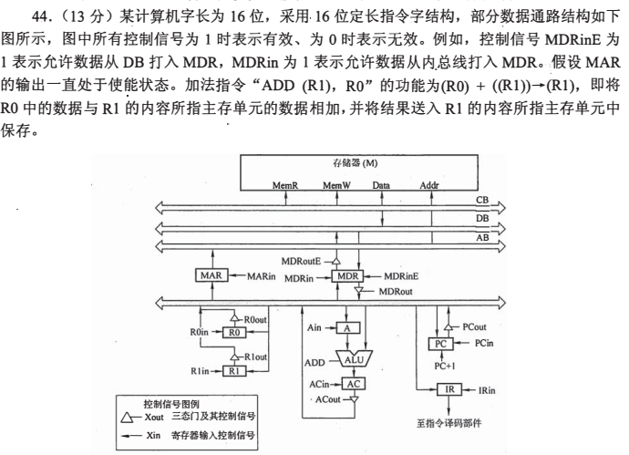

## 前言

关于计组、操作系统和计网，我认为学习方法和数据结构有差别。

对于这三门课，主要是心里要有一个整体的模型，基本上是一章一个模型。每道题目只要套到这个模型分析，那么题目就很容易能做出来。

需要注意的就是很多时候不要想当然分析，而是必须要套到某个模型上。

学习这门课，模型是重中之重的，当然其他操作系统和计网也需要非常重视模型。

## 计算机系统概述

### 考纲 - 计算机系统概述

- 计算机系统层次结构
- 计算机系统的基本组成
- 计算机硬件的基本组成
- 计算机软件和硬件的关系
- 计算机系统的工作原理：“存储程序”的方式；高级语言程序与机器语言程序的转换；程序和指令的执行过程

- 计算机性能指标
- 吞吐量；响应时间；CPU 时钟周期；主频；CPI；CPU 执行时间；MIPS；MFLOPS；GFLOPS；
  TFLOPS；PFLOPS；EFLOPS；ZFLOPS

### 计算机系统层次结构

这个考点比较绕，主要可以从下面走：

高级语言 -> 汇编语言 -> （操作系统） -> 机器语言 -> 体系结构 ISA -> 微程序控制器。

可以理解为谁为谁提供服务。这里的操作系统派在这里不是很准确，但是也没什么大问题。

可以区分语言层和硬件接口：高级语言通常经编译器转换为汇编语言，
再由汇编器生成遵循 ISA 的机器代码。ISA 规定软件可见的指令、编码和行为，
微体系结构则负责实现 ISA。操作系统属于系统软件层，为应用程序提供硬件抽象和资源管理。

还需要辨析编译、汇编、翻译、链接的区别。

编译通常将高级语言转换成汇编语言或目标代码；汇编器将汇编语言转换成机器代码。
“翻译”是把一种语言转换成另一种语言的总称，其中逐条转换且不生成目标文件的过程也是翻译。
链接器将多个目标文件和库连接成可执行文件，是操作系统那块的概念。

此外，还有 ISA。ISA 是指令集体系结构，相同的 ISA 可以对应不同的机器实现。
例如，x86 ISA 可以经历多代硬件迭代，而 ISA 本身保持兼容。

### 存储程序的执行流

这块放在 CPU 那一章细讲，主要是理解控制驱动和数据驱动。
控制驱动由控制流决定计算顺序，数据驱动则在输入数据就绪时触发计算。

### 性能指标

主要是记忆性的内容，常考 CPI、IPS 及其转换关系。

CPI 通常表示平均每条指令所需的时钟周期数，主频 $f$ 表示 CPU 每秒的时钟周期数。
一个时钟周期为 $T_{\text{cycle}}=1/f$，一条指令的平均执行时间为
$T_{\text{instr}}=\mathrm{CPI}/f$；在单一指令流、以平均 CPI 估算时，指令吞吐率为
$\mathrm{IPS}=f/\mathrm{CPI}$。

对于这个考点，需要注意题目描述：有时给出执行 $x$ 条指令，
有时给出执行 $y$ 个时钟周期。

此外，机器 A 的主频高、机器 B 的主频低，并不意味着某程序在 A 上的运行时间
一定比在 B 上短。

做这类题可以设总指令数为 $N$。

## 数据表示和运算

### 考纲 - 数据表示和运算

- 数制和编码：进位计数制及其相互转换；定点数的编码表示
- 运算方法和运算电路：
  - 基本运算部件：加法器；算术逻辑单元
  - 加减运算：补码加减运算器；标志位的生成
  - 乘除运算：乘除运算的基本原理；乘法电路和除法电路的基本结构
- 整数的表示和运算：无符号数的表示和运算；有符号数的表示和运算
- 浮点数的表示和运算：IEEE 754 标准；浮点数的加减运算

### 字，字节，字长，位

什么是位，什么是字节，什么是字，什么是字长？

位是最小的单位，一个二进制位只能表示 0 或 1。

字节是 8 位；按无符号数解释时，一个字节可以表示 $0$ 到 $255$。
字节通常是存储和编址的基本单位。

而什么是字，什么是字长，需要根据计算机本身的系统结构来确定。

例如，对于某些早期机器，可以用 2 字节表示一个字，即字长为 16 位；
但字长和编址粒度是两个独立概念，不能由前者推出按字编址。

现代计算机通常按字节编址，但 1 个字通常包含多个字节，具体取决于 ISA（常见为 2、4 或 8 字节）。

### 数制和编码

这个考点说难也难，说简单也简单，主要是细节问题。

2 进制、8 进制、10 进制、16 进制的相互转换。

对于十进制转二进制的整数部分，可以采用短除法：除以 $2$ 并取余数，
直到商为 $0$，再从下到上把余数拼接起来。

对于十进制转二进制的小数部分，可以反复乘以 $2$ 并取整数部分，
直到小数部分为 $0$，或达到所需精度，再从上到下把整数部分拼接起来。

当然，熟练后更快的做法是拼凑，也就是利用 $2^x$ 的幂次展开转换为对应的二进制数。

这里可以注意，不是所有的十进制数都可以精确转换为二进制数，例如
$0.1$ 的二进制展开是无限循环小数。

对于二进制转十进制，可以采用按权展开法，把各位按权展开后相加。

对于八进制转二进制，可以采用拆分法，把每个八进制数字拆成 3 个二进制位。

对于二进制转八进制，可以采用合并法，每 3 个二进制位合并为 1 个八进制数字。

对于十六进制转二进制，可以采用拆分法，把每个十六进制数字拆成 4 个二进制位。

对于二进制转十六进制，可以采用合并法，每 4 个二进制位合并为 1 个十六进制数字。

还可以注意表示，二进制数可以表示为 B 的形式，八进制数可以表示为 O 的形式，十六进制数可以表示为 H 的形式。

例如 $1010_2=1010\mathrm{B}$、$13_8=13\mathrm{O}$、$15_{16}=15\mathrm{H}$。

### 真值，机器数，无符号数与有符号数，编码

真值指的是机器数在指定编码下对应的实际值。例如，按 4 位原码解释时，
$1010_2=-2_{10}$；换用无符号数或补码解释时，结果会不同。

机器数指的是计算机中实际存储的值，一般都是以二进制的方式存储。

需要注意的是，计算机存储的是位串；编码规则决定如何解释这些位串，同一个数在不同编码下的位串也可能不同。

在讨论编码之前，需要捋清楚无符号数和有符号数的区别。

#### 无符号数与有符号数

无符号数指的是机器数中不表示负数，即表示非负数（包括 0）。
所有位都用于表示数值，不需要单独的符号位。

例如，8 位无符号数可以表示的范围为 $0$ 到 $255$，即
$00000000_2$ 到 $11111111_2$。

而有符号数的第一位一定是符号位，0 表示正数，1 表示负数。需要注意的是，原码、反码、补码都是基于 有符号数 去讨论的，所以即便原码看着和无符号数很像，但是其本质是不一样的。

#### 原码

原码的第一位是符号位，0 表示正数，1 表示负数，后续的位数表示数值的绝对值。

例如对于 15 和 -15，其 8 位原码分别为 $00001111_2$ 和 $10001111_2$。

对于 8 位原码，其表示范围为 $[-127,127]$；负数和正数的最大编码分别为
$11111111_2$ 和 $01111111_2$。

从而产生了一个问题，即 0 的表示是不唯一的，即 $00000000_2$ 和 $10000000_2$ 都表示 0。

原码很直观，但是这里先不讲为什么原码的计算很不方便。

由于原码的计算很不方便，所以很少在计算机中使用。

#### 反码

反码的第一位是符号位，0 表示正数，1 表示负数，后续的位数是数值的绝对值的反码。

这里先不讨论反码的来源，先说反码的计算方法。

对于正数，其反码和原码相同，因为正数的反码就是其本身。

对于负数，其反码是原码除了符号位的每一位取反，即 0 变 1，1 变 0。

例如对于 15 和 -15，其 8 位反码分别为 $00001111_2$ 和 $11110000_2$。

对于 8 位反码，其表示范围为 $[-127,127]$；负数和正数的最大编码分别为
$11111111_2$ 和 $01111111_2$。

从而也有一个问题，即 0 的表示是不唯一的，即 $00000000_2$ 和 $11111111_2$ 都表示 0。

反码在现代整数编码中已经少用，主要作为补码的过渡概念。

### 加法器、补数与补码的来源

加法器是计算机中用于执行二进制加法运算的核心逻辑电路，主要包括半加器、全加器以及多位并行加法器。

#### 半加器（Half Adder）

半加器只负责计算本位两个一位二进制数的加法，不考虑来自低位的进位。

输入：被加数 $A$、加数 $B$。

输出：本位和 $S$，向高位的进位 $C$。

逻辑表达式：

$$
S=A\oplus B,\qquad C=A\land B
$$

示例：计算 $1+1$ 时，$S=1\oplus1=0$，$C=1\land1=1$，
合起来输出二进制 $10_2$。

半加器无法接收低位产生的进位输入，因此不能直接用于多位数的进位加法。

#### 全加器（Full Adder）

全加器在半加器的基础上，增加了接收低位进位的功能。

输入：被加数 $A$、加数 $B$，来自低位的进位 $C_{\mathrm{in}}$。

输出：本位和 $S$，向高位的进位 $C_{\mathrm{out}}$。

逻辑表达式：

$$
\begin{aligned}
S&=A\oplus B\oplus C_{\mathrm{in}},\\
C_{\mathrm{out}}&=(A\land B)\lor\bigl(C_{\mathrm{in}}\land(A\oplus B)\bigr)\\
&=(A\land B)\lor(A\land C_{\mathrm{in}})\lor(B\land C_{\mathrm{in}})
\end{aligned}
$$

示例：计算 $1+1+1$（包含低位进位 $1$）时，$S=1$，
$C_{\mathrm{out}}=1$，合起来输出二进制 $11_2$。

#### 并行加法器（Parallel Adder）

为了实现多位二进制数的快速相加，通常将多个全加器组合起来使用：

串行进位加法器将多个全加器首尾相连，进位从低位向高位逐级传递，延迟较高。

超前进位加法器通过进位生成和传递的布尔逻辑提前计算各位进位，
不必等待低位逐级传递，延迟较低。实际工程中常以 4 位加法器作为基本模块，
再通过进位链级联。

在这里讲加法器，是因为可以理解补码的来源。

暂时不考虑溢出的情况，仅考虑下面的情况。

对于 8 位无符号数，$13$ 和 $12$ 的二进制表示分别为
$00001101_2$ 和 $00001100_2$，相加可得 $00011001_2$，即 $25$。

对于 8 位无符号数，$13-12$ 可写为
$00001101_2-00001100_2=00000001_2$，结果为 $1$。

对于 8 位原码，$13+12$ 的编码为
$00001101_2+00001100_2=00011001_2$，结果为 $25$。

对于 8 位原码，$13-12$ 的编码为
$00001101_2-00001100_2=00000001_2$，结果为 $1$。

这看起来对人类而言很直观，但是对于计算机来说，相减如何实现？

如果直接按原码的“绝对值相减、再确定符号”规则实现，
需要比较绝对值并单独处理符号；如果为无符号减法设计专用路径，
还要处理借位。

这些额外逻辑会增加硬件复杂度，因此通常复用加法器和补码来实现减法。

硬件资源是稀缺的，所以需要一种更简单的方法来实现减法。

对模 $n$ 的无符号数 $x$，其补数定义为
$(-x)\bmod n=(n-x)\bmod n$。

对于 8 位无符号数，模为 $2^8=256$。
因此，$12$ 的补数为 $256-12=244$，对应的位串为 $11110100_2$。

考虑硬件实现，计算 $13-12$ 等同于计算
$13+(256-12)=13+244=257$。在 8 位寄存器中，最高进位被舍弃，
结果为 $257\bmod256=1$。

在固定 $n$ 位二进制、模为 $2^n$ 的情况下，补数可以通过对 $x$ 的每一位取反再加 $1$ 得到。

所以可以得出下面的结论：

计算机的寄存器位数是固定的。对于 8 位无符号寄存器，其模为 $2^8=256$。

固定宽度运算只保留低 8 位，结果等价于按模 $256$ 截取；是否发生“溢出”要看数值解释：
无符号数看进位标志 CF，补码有符号数看溢出标志 OF。

在模 256 的系统中，减去一个数相当于加上这个数的补数。

例如：

$$
13-12\equiv13+(256-12)\pmod{256}
$$

那么对于有符号数呢？

考虑原码 $13-12$：其位串为
$00001101_2-00001100_2$。如果采用与无符号数补数求法类似的思路，能否得到正确结果？

#### 补码

补码的第一位是符号位，0 表示非负数，1 表示负数。对于非负数，其补码和原码相同。
对于负数，其补码是原码除符号位外的每一位取反再加 $1$。

对于 8 位补码，其表示范围为 $[-128,127]$，即从 $10000000_2$ 到
$01111111_2$；没有正 $128$，且只有一个 $0$。

例如，$-12$ 的原码为 $10001100_2$，其补码为 $11110100_2$。

在 8 位补码中，$13-12$ 等同于
$13+[-12]_{\text{补}}$，即
$00001101_2+11110100_2=00000001_2$；最高进位因位数限制被舍弃。

对于补码，可以把第一位（符号位）理解为负位权。
对 8 位补码，$-12$ 的位串可展开为
$-2^7+2^6+2^5+2^4+2^2=-12$。

#### 移码

对 $n$ 位整数，常规定义的移码（偏置码）偏置为 $2^{n-1}$，
编码值为真值加该偏置。

对于 $-128$，其补码为 $10000000_2$，其 8 位移码为 $00000000_2$。

对于 $0$，其补码为 $00000000_2$，其 8 位移码为 $10000000_2$。

对采用 $n$ 位补码、真值范围为 $[-2^{n-1},2^{n-1}-1]$ 的编码，
移码的位串等价于将补码的符号位取反。

移码在计算机中主要用于表示浮点数的阶码。IEEE 754 单精度的偏置为 $127$，
双精度的偏置为 $1023$。

#### C 语言整数类型及转换

C 语言整数类型的精确位宽由实现和 ABI 决定。但考研用的是 long 为 32 位。

以 `CHAR_BIT=8`、ILP32 环境举例：

- `char`：1 字节，通常为 8 位；
- `short`：2 字节，16 位；
- `int`：4 字节，32 位；
- `long`：4 字节，32 位；
- `long long`：8 字节，64 位。

在 LP64 等其他 ABI 中，`long` 可能是 8 字节；C 标准只规定各类型的最小范围。

对于整数类型和转换，需要注意：

转换到无符号目标类型时，结果按目标类型的模保留低位；
转换到有符号目标类型且值无法表示时，结果由实现定义，不能一概而论为截断。

在常见二补码实现中，如果是短转长，整型提升或转换通常会进行扩展：无符号数高位补 $0$，
有符号数按符号位扩展；具体结果仍以目标类型和实现规则为准。

```c
unsigned short a = 65530;
int b = a;
```

分析可知，对于无符号数 $a$，其 16 位十六进制表示为 `FFFAH`。
整型提升时零扩展为 32 位 `0000FFFAH`，再解释为 `int`，结果为 $65530$。

```c
short a = -1;
unsigned int b = a;
```

分析可知，对于 16 位有符号数 $a$，其位串为 `FFFFH`。
整型提升先符号扩展为 32 位 `FFFFFFFFH`，再转换为 `unsigned int`，
结果为 $2^{32}-1$。

### 基本的计算

#### 移位运算

移位运算分为逻辑移位和算术移位。

逻辑移位是直接将二进制位向左或向右移动，移动后空位补 0。

算术右移时，高位补入原符号位；算术左移时，低位始终补 $0$。

例如，对于 8 位补码 `10101010`，逻辑左移一位和算术左移一位均为
`01010100`；逻辑右移一位为 `01010101`，算术右移一位为 `11010101`。

由于二进制的表达，移位运算天然地和乘除法有关系。

在不发生溢出的前提下，算术左移通常相当于乘以 $2$；
对非负数，算术右移相当于整除 $2$，对负数则通常向负无穷取整。

例如，8 位补码 `11001010` 的真值为 $-54$。
算术左移一位得到 `10010100`，真值为 $-108$；
算术右移一位得到 `11100101`，真值为 $-27$。

需要注意的是，左移时若有效位被丢弃或符号位发生改变，可能发生溢出。
例如，8 位补码 `10000000` 的真值为 $-128$。算术左移一位得到
`00000000`（按 8 位补码解释为 $0$），但数学结果应为 $-256$，
超出了 8 位补码的可表示范围。

#### 对加法器的补充

对于固定为 $n$ 位的加法器，实现减法通常将 $B$ 按位取反，并把最低位进位输入设为 $1$，
最后只保留低 $n$ 位：

$$
A-B\equiv A+\lnot B+1\pmod{2^n}
$$

从上面可以看出，反码类似加法器的一种状态。对于加法器而言，不是直接把 $B$ 取补，而是取反再 $+1$。

#### 补码加减法运算

本质上，补码加减法运算就是将减法转换为加法。

对 $n$ 位补码运算，结果按模 $2^n$ 截取：

$$
[A+B]_{\text{补}}=[A]_{\text{补}}+[B]_{\text{补}}\pmod{2^n},
$$

$$
[A-B]_{\text{补}}=[A]_{\text{补}}+[-B]_{\text{补}}\pmod{2^n}
$$

#### 判定溢出与标志位

判断补码溢出常用以下三种方法。对加法而言，只有同号数相加可能溢出：
两个正数相加得到负数，或两个负数相加得到正数时发生溢出。
对减法而言，只有异号数相减可能溢出：被减数与减数符号不同，且结果符号
与被减数符号不同时发生溢出。

也可以比较进入符号位和从符号位产生的进位：二者不同时发生溢出。

第三种方法是采用双符号位，即 $00$ 表示正数，$11$ 表示负数，
$01$ 表示正数溢出，$10$ 表示负数溢出。

需要注意的是，双符号位只在运算过程中使用；存储一个 $n$ 位补码数时仍只保留 1 位符号位。

4 个标志位

- OF：Overflow Flag，代表有符号数运算是否发生溢出。
- SF：Sign Flag，代表运算结果的符号位。
- ZF：Zero Flag，代表运算结果是否为 0。
- CF：Carry Flag，代表无符号运算产生的进位或借位（具体语义取决于指令集）。
  - 对采用“减数取反并加 $1$”的加法器，硬件常用
    $\text{CF}=C_{\text{out}}\oplus\text{Sub}$，其中 $\text{Sub}=0$ 表示加法、
    $\text{Sub}=1$ 表示减法。
  - 加法运算（$A+B$）：$\text{CF}=C_{\text{out}}$。若最高位产生进位，
    则表示无符号加法溢出。
  - 减法运算（$A-B$）：在 x86 等“CF 表示借位”的约定下，
    $\text{CF}=\lnot C_{\text{out}}$；若 $A<B$，则发生借位。

需要注意的是，对于无符号数的加减法，OF 通常不用于判断无符号溢出；
对于有符号数运算，CF 通常不用于判断有符号溢出，但处理器仍可能同时更新这两个标志位。

#### 乘法与除法

常见实现有移位加法迭代、顺序乘法器和阵列乘法器。

对于这三者，可以在 CPU 那一章有一个经典的分析，即为什么从时间上来讲，模拟耗时 > 乘法器 > 乘法阵列器。

即大体上来分析，模拟需要消耗多个指令周期，乘法器只需要消耗一个指令周期，而乘法阵列器只需要消耗一个时钟周期。

> 先过。

- 无符号数的乘法器

- 有符号数的乘法器

#### 除法器的两种方式

> 先过。

- 恢复余数法

- 不恢复余数法

### IEEE 浮点数

#### 浮点数的表示

$N = (-1)^S - M - R^E$

- float 型浮点数
  - 符号位：1 位
  - 阶码：8 位
  - 尾数：23 位
- double 型浮点数
  - 符号位：1 位
  - 阶码：11 位
  - 尾数：52 位

做这类题的时候，主要是要小心翼翼，不要脑子抽了。

#### IEEE 浮点数的表示范围与特殊浮点数

| 类型 | 符号位 (S) | 阶码位 (E) | 尾数位 (M) | 阶码偏置值 (Bias) | 最小正非规范化数 (绝对值极小) | 最小正规范化数 | 最大正规范化数 (绝对值极大) | 十进制有效数字位数 |
| :--- | :--- | :--- | :--- | :--- | :--- | :--- | :--- | :--- |
| 单精度 (float, 32位) | 1位 | 8位 | 23位 | 127 | $2^{-149} \approx 1.40 \times 10^{-45}$ | $2^{-126} \approx 1.18 \times 10^{-38}$ | $(2 - 2^{-23}) \times 2^{127} \approx 3.40 \times 10^{38}$ | 约 6 ~ 7 位 |
| 双精度 (double, 64位) | 1位 | 11位 | 52位 | 1023 | $2^{-1074} \approx 4.94 \times 10^{-324}$ | $2^{-1022} \approx 2.23 \times 10^{-308}$ | $(2 - 2^{-52}) \times 2^{1023} \approx 1.80 \times 10^{308}$ | 约 15 ~ 17 位 |

| 特殊数值名称 | 阶码字段 (E) | 尾数字段 (M) | 含义与说明 |
| :--- | :--- | :--- | :--- |
| 正零 / 负零 ($\pm 0$) | 全 0 | 全 0 | 符号位 $S=0$ 表示 $+0$，$S=1$ 表示 $-0$。在逻辑比较上通常 $+0 == -0$。 |
| 正无穷 / 负无穷 ($\pm \infty$) | 全 1 (单精度为255，双精度为2047) | 全 0 | 符号位 $S=0$ 表示 $+\infty$，$S=1$ 表示 $-\infty$。通常出现在溢出或除以0的情况。 |
| 非数 (NaN, Not a Number) | 全 1 (单精度为255，双精度为2047) | 不全为 0 | 表示无效的未定义操作（例如 $0/0$、$\infty - \infty$ 或计算负数的 $(x)^{1/2}$ 次方时产生）。分为静默NaN (qNaN) 和发信号NaN (sNaN)。 |
| 非规范化数 (Subnormal) | 全 0 | 不全为 0 | 用于实现“渐进下溢”（Gradual Underflow），隐藏位变为 $0$（即 $0.M \times 2^{1-\text{Bias}}$），填补 $0$ 到最小规范化数之间的空隙。 |

#### 浮点数的相关计算

- 对阶：小阶向大阶看齐
- 尾数加减
- 尾数规格化
  - 右规：1x.xxx，需要右规
  - 左规：0.xxx1，需要左规
  - 左规和右规的具体含义是 1 往拿动
- 舍入
  - 最经典的方法：看末位如果最后三位，这里的最后三位是不属于正式的，小于 100，那么就舍去，大于 100 就进 1，等于 100 看前一位，如果是 1 就进位，如果是 0 就舍去
  - 直接进位
  - 直接舍去
  - 向无穷进位 / 舍去
  - 向 0 进位 / 舍去
- 溢出判断
  - 上溢
  - 下溢：下溢指的是要下溢到非规格化浮点数都表示不了的程度

#### 浮点数与整型转换相关

int 转 float，不会溢出，但可能会发生精度丢失。

int 或 float 转 double，精确原值

double 转 float，可能溢出 / 精度丢失

float 或 double 转 int，小鼠直接丢弃（精度丢失） / 溢出

#### 数据对齐、大端法与小端法

- 大端法和小端法
- 数据对齐

```c++
struct Test{
    char a;
    short b;
    int c;
}
```

假设首地址是 0x1000H，那么 a 的地址是 0x1000H，b 的地址是 0x1002H（因为边界对齐，所以空 1 位），c 的地址是 0x1004H。

## 存储系统

### 考纲 - 存储系统

- 存储器的分类
- 层次化存储器的基本结构
- 半导体随机存储器（RAM）：SRAM，DRAM，Flash 存储器
- 主存储器：DRAM 芯片和内存条、多模块存储器、主存储器和 CPU 之间的连接
- 外部存储器：磁盘存储器、固态硬盘
- 高速缓冲存储器
  - Cache 的基本原理：Cache 和主存之间的映射方式
  - Cache 中的主存替换算法；cache 写策略
- 虚拟存储器
  - 虚拟存储器的基本概念
  - 页式虚拟存储器：基本原理、页表、地址转换、TLB（快表）
  - 段式存储器的基本原理
  - 段页式存储器的基本原理

### 存储器分类

- 按存储元件分类
  - 半导体材质：SRAM，DRAM
  - 磁性材料：磁盘
  - 光介质：光盘（需要注意可以随即寻址，但是只能顺序读）

- 存取方式
  - 随机存取：RAM
  - 顺序存取：磁带
  - 直接存取：磁盘
  - 相联存储：TLB，路由表，按内容访问的存储器

- 信息可更改性
  - 只读：ROM，注意 flash 属于只读
  - 可读可写：RAM

- 可保存性
  - 易失性：RAM
  - 非易失性：ROM，磁盘，光盘

### 存储器的组成与层次化

#### 层次化

CPU - Cache - 主存 - 磁盘 - 磁带/光盘

#### 辨析存储周期与存取时间

存储周期 > 存取时间，存储周期 = 存取时间 + 复原时间。

### 主存

最先需要辨析的，是主存和内存。考研范围里，主存和内存是一个意思，而内存和生活中的常用语是不同的。

#### SRAM

本质为双稳态触发器，无须刷新。静态 RAM 存取速度快，但是集成度低，功耗大，成本高一般用于 cache 上。

#### DRAM

本质为电容，需要定时刷新。存取速度较慢，容易漏电丢失信息，读出过程为破坏性读出。

DRAM 需要地址线复用，并且需要注意的是，看清楚题目要求你计算什么。是地址线多少，还是几个 DRAM 组合起来的地址线多少。

“对于一个容量为 16\text{ KB}、按字节编址的主存系统，CPU 访问该主存所需的系统地址线总共为 14 根（因为 16\text{ KB} = 2^{14}\text{ B}）。

这 14 根地址线（A_{13} \sim A_0）的功能划分为：

高 4 位地址线（A_{13} \sim A_{10}）：用于片选译码。整个 16\text{ KB} 空间按 1\text{ KB} 划分为 16 个模块，通过这 4 根线译码产生片选信号，分别选中 2\text{ KB} 的 ROM 模块以及 14 片 1\text{ K}\times 8\text{ 位} 的 DRAM 芯片；

低 10 位地址线（A_9 \sim A_0）：用于片内寻址。由于单片 DRAM 采用地址线复用技术，该 10 位片内地址在进入 DRAM 芯片前会被分时复用（拆分为 5 位行地址和 5 位列地址），因此所有 14 片 DRAM 的片内地址引脚全部并联接到这组复用线路上。

注意，DRAM 内部是 5 根地址线，然后整个系统的地址总线就是 14。

有三种刷新（复原）方式：

- 集中刷新：在规定的最大复原周期内，前面的时间专门划给 CPU 时候，然后最后的时间专门划给刷新，缺点是有死区
- 分散刷新：把每一个系统工作周期分为两半，前半部分用来供 CPU 进行正常的读写操作，后半部分固定用来复原刷新一行存储单元，复原操作完全分散在每一个存取周期内部，系统响应极度平滑，随时可访存；但由于每次存取都要强行带上复原操作，导致整个存取周期直接翻倍拉长，大大降低了存储器的实际工作效率
- 异步刷新：集中与分散的折中方案。假设刷新周期为 2ms，存储阵列有 $128$ 行，就把 2ms 均分为 $128$ 段，每隔约 $15.6\mu s$ 发出一次单行的复原请求。每一行有各自短暂的“死区”（仅占用一个读写周期的时间），死区被完全打散，宏观上几乎感觉不到停顿

对于集中刷新，集中刷新被粗暴分成两个部分，一部分是给 CPU 使用，一部分是给刷新使用。

对于分散刷新，是每一个工作周期都刷新，也就是执行一下，刷新一下。

对于异步刷新，是执行一行刷新一次。

一般采用异步刷新，从而引出了如何设计几行几列（m × n，m >= n 且 n 尽可能地要接近 m）。

对于行缓冲器，一般是 SRAM 实现，用于缓存行数据。

#### ROM

断电后不会丢失数据，可靠。

- ROM
  - MROM，掩膜 ROM，不可修改
  - PROM，一次编程 ROM
  - EPROM，可擦除可编程 ROM，使用紫外线擦除且擦除次数有限
  - EEPROM，电擦除可编程 ROM
- Flash 闪存，读写性能不对称
- SSD 固态硬盘

可以注意，主存里一般是有 ROM 的，因为要存储 BIAS。

#### 多模块存储器

- 连续编址，高位地址作为模块号，低位地址为模块内地址，各个模块不能并行访问，无法提高存储器的吞吐率。

- 交叉编址（低位编址），低位地址用作模块号，高位地址作为模块内地址。
  - 轮流启动：按模块号轮流启动，每个模块的存取周期为 T，则连续读取 m 个字所需要的时间为 t = T + (m-1)-r
  - 同时启动：一次性取 n 个模块，即连续几个字节一起读，可以理解为类似超字长

### 主存与 CPU 的连接

这块知识并不难，主要是要把 16 进制的地址转换成 2 进制理解，并且不要想当然地去计算（比如说本来只有位扩展，但是写的字位扩展）。

还有就是一定要捋清楚 A0 - A15 谁是高位，谁是低位，这个题目里会讲。

- 位扩展
- 字扩展
- 字位扩展

#### 磁盘与 SSD

- 磁盘：直接存取存储器，扇区是最小的单位。
  - 磁道（柱面） -> 盘面（磁头） -> 扇区（这个是地址划分）
  - 非格式化容量 > 格式化容量
  - 响应时间 = 排队时延 + 控制时间 + 寻道时间 + 旋转等待时间 + 数据传输时间（具体题目会给条件，给的条件的都要算进去）
  - RAID 独立冗余磁盘阵列。将多个独立的物理磁盘合成一个逻辑磁盘
    - RAID0
    - RAID1：镜像
    - RAID2：海明码
    - RAID3：位交叉奇偶校验
    - RAID4：块交叉奇偶校验
    - RAID5：无独立校验盘分布式奇偶校验磁盘阵列

- SSD
  - 基于闪存的存储设备
  - 读/写以页为单位，擦除以块为单位
  - 随机写慢，是因为擦除时间耗时长，并且如果修改的话，需要先复制到另一个页，写入后然后再写回。
  - 磨损均衡
    - 动态磨损均衡：写入数据的时候优先写入到空闲的页
    - 静态磨损均衡：在后台自动迁移到高磨损块中（把基本只读的东西搬运）

### cache

#### 局部性原理

- 时间局部性：访问我之后，在短时间内还会再访问自己
- 空间局部性：访问我之后，在短时间内会访问我身边的人

#### cache 命中率

- 耗时
  - 在访问 cache 时同时读主存
  - 在访问 cache 后发现未命中，再读主存
  - 这两种方案看具体题目怎么讲
- cache 命中率分析（见后面）

#### cache 映射方式

- 直接映射
- 全相联映射
- 组相联映射

这三个就不细写了，下面等下以场景分析。

#### cache 替换算法

- RAND
- FIFO：对于 FIFO，需要注意其并不是按照物理顺序存进去的，而是也要存一个 id 来记录
- LRU：最近最少使用，对于 n 个块需要 log2n 向上取整位来记录。每次访问都把自己的计数器清零，其他块的计数器 +1，替换则是替换掉计数器最大的
- LFU：最不经常使用算法，即新装入时计数器初始化为 0，每次访问 +1（到最大值了则是不变）。每次替换替换掉最小的。这个方法的问题是全局较大可能并非近期需求最大，例如半个小时前正在微信通话，而微信通话结束了，现在任务需求是聊天，那么微信通话的版块会持续占用

#### cache 一致性问题

- cache 写命中处理
  - 全写法（直写法）：同时写入主存和 cache，可以引入缓冲机制
  - 回写法（写回法）：仅写回 cache，提高了 cache 效率
- cache 写不命中处理方法
  - 写分配法：写入主存对应单元，然后调入 cache（也有的书是先调入 cache 再写 cache），具体题目具体分析
  - 非写分配法：不命中直接写入主存，不调入 cache

#### cache 的容量与位数计算

注意指令 cache 与数据 cache 分离（看题目里具体要求）。

有效位是必要的，因为 cache 的命中与否需要通过有效位来判断。

对于脏位，则是回写法需要。

对于替换算法，例如 LRU，FIFO，LFO 需要替换算法位（注意直接映射不需要替换算法）

其他的是标记位 tag，数据位。

#### cache 的应用

- cache 数据与指令分离
- 多级 cache

#### 关于 cache 其他需要注意的事项

cache 块大小和 cache 本身大小无关。

### 虚拟存储器

这块内容主要是操作系统的部分讲的很详细，下面主要讲几点比较需要注意的。

#### 组相联 TLB

与 cache 类似。

#### 辨析 TLB，Page 和 cache 的层次

见下面的分析。

#### 页号、块号与具体地址

需要辨析，不要相互混淆，尤其是在做题的时候，给的是第 x 块，而不可以将之当成具体地址去算 cache。

由于边界对齐，所以很多时候都不需要存完整的地址，存 “块” 地址即可。

### cache 命中率分析

假设系统环境如下：

1. 数据类型：标准 32 位整型，每个 `int` 占 $4\text{ B}$。
2. Cache 块大小（Block Size）：$B = 64\text{ B}$（即每个 Cache 块恰好容纳 $64 / 4 = 16$ 个 `int`）。
3. Cache 总容量（Capacity）：$C = 8\text{ KB} = 8192\text{ B}$（共 $8192 / 64 = 128$ 个 Cache 行）。
4. 映射与替换：采用全相联映射（Fully Associative），替换策略为 LRU。

#### 场景 1 深入辨析（容量截断效应）

##### 1. 数据规模与排布 - 1

- 数组规模：$1024 \text{ 行} \times 64 \text{ 列}$。
- 数组总大小：$1024 \times 64 \times 4\text{ B} = 256\text{ KB}$。
- 每行大小：$64 \times 4\text{ B} = 256\text{ B}$（跨越 $256 / 64 = 4$ 个 Cache 块）。
- 核心关系：数组总容量（$256\text{ KB}$）$\gg$ Cache 容量（$8\text{ KB}$）。

##### 2. 行优先访问分析 - 1

- 访问模式：按内存连续物理地址线性扫描。
- 命中过程：
  - 每当访问到新 Cache 块的首个元素时，发生 1 次冷缺失（Cold Miss），并将包含连续 16 个 `int` 的整块装入 Cache。
  - 紧随其后的 15 个元素全部命中空间局部性（Hit）。
- 命中率计算：
  $$\text{Hit Rate}_{\text{行}} = \frac{16 - 1}{16} = \frac{15}{16} = 93.75\%$$
  满足命中率 $\ge 90\%$ 的要求！

##### 3. 列优先访问分析 - 1

- 访问模式：外层循环遍历列，内层循环遍历行。
- 访存步长（Stride）：每次访问跨越一行，步长为 $256\text{ B}$（$4$ 个块）。
- 命中过程：
  - 遍历第 0 列时，依次访问 `A[0][0], A[1][0], ..., A[1023][0]`，共访问 1024 个元素，分布在 1024 个互不相同的 Cache 块中。
  - 遍历整列需要的数据量为 $1024 \times 64\text{ B} = 64\text{ KB}$。
  - 但 Cache 只有 $8\text{ KB}$（只能存 128 个块）！当访问到第 128 行以后，前面装入的块早就被 LRU 策略无情淘汰冲刷掉了。
  - 当第 0 列全部结束、开始访问第 1 列的 `A[0][1]` 时，原本包含该元素的块早在一万年前就被踢出了 Cache！
  - 因此，每个元素在被访问时，其所在的块都不在 Cache 中。
- 命中率计算：
  $$\text{Hit Rate}_{\text{列}} = 0\%$$
  完美达成列访问 $0\%$ 的指标！

#### 场景 2 深入辨析（工作集常驻效应）

##### 1. 数据规模与排布 - 2

- 数组规模：$64 \text{ 行} \times 24 \text{ 列}$。
- 数组总大小：$64 \times 24 \times 4\text{ B} = 6144\text{ B} = 6\text{ KB}$。
- 占用的 Cache 块数：$6144\text{ B} / 64\text{ B} = 96$ 个块。
- 核心关系：数组总容量（$6\text{ KB}$）$<$ Cache 容量（$8\text{ KB}$，可容纳 128 个块）。
- 决定性结论：整个数组可以被 Cache 100% 完全装下，遍历全程不会触发任何容量替换（Capacity Eviction）！

##### 2. 行优先访问分析 - 2

- 访问总次数：$64 \times 24 = 1536$ 次。
- 缺失情况：按行线性读入，共经历 $96$ 个数据块，因此发生 $96$ 次冷缺失（Cold Miss）。
- 命中情况：其余所有访问均为块内空间局部性命中，命中次数为 $1536 - 96 = 1440$ 次。
- 命中率计算：
  $$\text{Hit Rate}_{\text{行}} = \frac{1440}{1536} = \frac{15}{16} = 93.75\%$$

##### 3. 列优先访问分析 - 2

- 访问总次数：同样是 $1536$ 次。
- 缺失情况：
  - 列优先访问时，由于数据跳步访问，冷缺失的发生时刻被打散了。
  - 但是，因为 Cache 容积（128 行）大于数组占用的总行数（96 行），一旦某个块因冷缺失被调入 Cache，在整轮遍历结束之前，它就永远不会被挤出 Cache！
  - 这意味着：整个数组占据的这 96 个块，无论按什么乱七八糟的顺序访问，每个块都仅且只会在第一次被触碰时发生 1 次冷缺失！
  - 整个遍历过程的总缺失次数依然严格等于 96 次！
- 命中情况：除了 96 次初次调入外，剩下的 $1536 - 96 = 1440$ 次访问，全部命中！
- 命中率计算：
  $$\text{Hit Rate}_{\text{列}} = \frac{1536 - 96}{1536} = \frac{1440}{1536} = 93.75\%$$

两者命中率不仅完全相同（均为 $93.75\%$），而且远超 $80\%+$！

#### 场景 3 $1024 \times 4$ 的长条矩阵

我们选取体系结构中极为经典的小列宽长矩阵：$1024 \text{ 行} \times 4 \text{ 列}$ 的 `int` 数组。

- 一行的大小：$4 \text{ 列} \times 4\text{ B} = 16\text{ B}$。
  - 核心几何特征：$16\text{ B} < 64\text{ B}$，一个 Cache 块内部可以横向并排严丝合缝地塞进：
    $$\frac{64\text{ B}}{16\text{ B}} = 4\text{ 行数组数据！}$$
- 数组总容量：$1024 \times 4 \times 4\text{ B} = 16384\text{ B} = 16\text{ KB}$。
  - 核心容量特征：数组总容量（$16\text{ KB}$）$= 2 \times$ Cache 容量（$8\text{ KB}$），Cache 无法一次性容纳整张数组，遍历全程会发生残酷的容量替换（Capacity Eviction）！
- 数组占用的总 Cache 块数：$16\text{ KB} / 64\text{ B} = 256$ 个块。

#### 场景 3 访问全流程深入推演

##### 1. 行优先访问 - 3

- 访问模式：内存连续线性地址访问。
- 过程推演：
  - 每当指针跨过一个 64B 边界时，触发 1 次冷缺失（Cold Miss），将 64B（连续 16 个 `int`，即整整 4 行数据）调入 Cache。
  - 随后的连续 15 次访问全部在同一 Cache 行内命中（Hit）。
- 命中率计算：
  $$\text{Hit Rate}_{\text{行}} = \frac{16 - 1}{16} = \frac{15}{16} = 93.75\%$$
  （连续空间局部性完美发挥，依然高达 $93.75\%$！）

##### 2. 列优先访问 - 3

- 访问模式：外层按列循环，内层按行循环（依次访问第 0 列的 `A[0][0] ~ A[1023][0]`，接着第 1 列……）。
- 跨度与块内渗透：
  - 访问 `A[0][0]`：缺失（Miss）！系统从内存调入包含 `A[0][0] ~ A[3][3]` 的整整 64 字节块。
  - 访问 `A[1][0]`：命中（Hit）！ 它就在刚才载入的块的第 2 个 16B 槽位里。
  - 访问 `A[2][0]`：命中（Hit）！ 它在同一个块的第 3 个 16B 槽位里。
  - 访问 `A[3][0]`：命中（Hit）！ 同样命中！
  - 访问 `A[4][0]`：跳出当前块范围，缺失（Miss）！ 调入下一块（包含第 4~7 行）。
  - 访问 `A[5][0], A[6][0], A[7][0]`：连续 3 次命中！
- 容量颠簸效应：
  - 当第 0 列全部遍历完时，共访问了 1024 个元素，消耗了 256 个 Cache 块的装载。
  - 但 Cache 只有 128 行！依据 LRU 策略，前半段（前 128 个块）早就被后半段冲刷出去了。
  - 因此，当开始遍历第 1 列的 `A[0][1]` 时，先前调入的块已经不在 Cache 中，无法享受列与列之间的时间局部性！
  - 也就是说：每一列都要重新经历一次上述的“一漏三中”周期！
- 命中率计算：
  在每一列内部，每连续 4 个垂直元素中，必有 1 次缺失，3 次命中：
  $$\text{Hit Rate}_{\text{列}} = \frac{4 - 1}{4} = \frac{3}{4} = 75\%$$

#### cache 命中率辨析

| 场景 | 数组规约 | 单行与 Cache 块关系 | 总容量与 Cache 容量 | 行访问命中率 | 列访问命中率 | 支配机制 |
| :--- | :--- | :--- | :--- | :--- | :--- | :--- |
| 场景 1 | $1024 \times 64$ ($256\text{ KB}$) | 行远大于块 ($256\text{ B} > 64\text{ B}$) | 撑爆 Cache ($256\text{ KB} \gg 8\text{ KB}$) | $93.75\%$ | $0\%$ | 容量惩罚：无时间局部性，列跨度抹杀空间局部性 |
| 场景 2 | $64 \times 24$ ($6\text{ KB}$) | 行大于块 ($96\text{ B} > 64\text{ B}$) | 整体容纳 ($6\text{ KB} < 8\text{ KB}$) | $93.75\%$ | $93.75\%$ | 工作集常驻：无淘汰挤出，全保底命中 |
| 场景 3 | $1024 \times 4$ ($16\text{ KB}$) | 行小于块 ($16\text{ B} < 64\text{ B}$) | 撑爆 Cache ($16\text{ KB} > 8\text{ KB}$) | $93.75\%$ | $75\%$ | 微观跨行渗透：块内垂直捕获，列访问破天荒兜底！ |

第二个的本质是所有数据小于整个 cache。

第三个的本质是一行数组数据小于一个 cache 行。

### TLB 组相联 + cache 组相联映射模型

4GB 逻辑地址空间以及 2^28B 的物理地址空间。主存块大小 64B，页大小 1KB。

一开始全是空的。

1. 虚拟地址（VA）划分（共 32 位）：
   - 页内偏移量（Page Offset）：页面大小为 $1\text{ KB} = 2^{10}\text{ B}$，占 10 位。
   - 虚拟页号（VPN）：$32 - 10 =$ 22 位。

2. TLB 结构设定（设为 2 路组相联，共 16 个表项）：
   - 组数 = $16 / 2 = 8$ 组，TLB 组索引（TLB Index）占 $\log_2 8 =$ 3 位。
   - TLB 标记（TLB Tag）占 $22 - 3 =$ 19 位。

3. 物理地址（PA）划分（共 28 位）：
   - 物理页号（PPN）：$28 - 10 =$ 18 位。
   - 页内偏移量（Page Offset）：与虚拟地址相同，占 10 位。

4. Cache 结构设定（设为 4 路组相联，Cache 总容量 16 KB）：
   - 块内偏移（Block Offset）：块大小 $64\text{ B} = 2^6\text{ B}$，占 6 位。
   - 块数 = $16\text{ KB} / 64\text{ B} = 256$ 块。
   - 组数 = $256 / 4 = 64$ 组，Cache 组索引（Cache Index）占 $\log_2 64 =$ 6 位。
   - Cache 标记（Cache Tag）占 $28 - 6 - 6 =$ 16 位。

#### 阶段一：硬件初次地址转换与 TLB 缺失

1. 发出虚拟地址：CPU 从程序计数器（PC）发出取指的 32 位虚拟地址 VA。
2. 查 TLB：MMU 提取 22 位 VPN，用其中的 3 位组索引定位 TLB 组，对比各路 Tag。
3. TLB Miss：初始全空，TLB 缺失。

#### 阶段二：访存查页表与触发缺页异常（Page Fault）

1. 查页表（Page Walk）：
   - MMU 结合页表基址寄存器（PTBR）与 VPN 计算出页表项（PTE）的物理地址并访问主存。
2. 检测到缺页：
   - 读出 PTE 后，硬件发现其有效位 Valid = 0，说明该页面尚未被调入物理内存中！
3. 抛出异常：
   - MMU 产生缺页异常（Fault），CPU 中断当前取指流程，保存当前的 PC 和程序状态字（PSW），硬件从用户态切换到内核态（核心态）。

#### 阶段三：操作系统内核接管处理（缺页中断服务程序）

1. 保护现场：OS 保存各通用寄存器现场。
2. 合法性检查：读取引发异常的虚拟地址（如 x86 的 CR2 寄存器），检查该地址是否合法（在进程的合法逻辑空间内且有执行权限）。
3. 分配物理页框：在主存中寻找一个空闲的物理页框（Frame），假设分配到的物理页号为 $\text{PPN}_x$。
4. 启动磁盘 I/O（调页）：
    - OS 向外存（磁盘/交换区）控制器发出读命令，将该页对应的 1KB 指令数据从外存读入到刚才分配的物理页框中。
    - 此时当前进程被置为阻塞态，CPU 调度其他进程执行（DMA 传输数据中）。
5. I/O 完成中断：
    - 1KB 数据全部传输进物理内存后，磁盘控制器发出 I/O 中断，OS 唤醒该进程。
6. 修改页表项（PTE）：
    - OS 将该页对应的 PTE 填入物理页号 $\text{PPN}_x$，将有效位置为 Valid = 1，设置访问权限。
7. 恢复现场与返回：
    - 恢复原进程现场，执行异常返回指令（如 `iret`），重新执行刚才被中断的那条取指指令，CPU 切回用户态。

#### 阶段四：重新取指与第二次地址转换

1. 重新发出 VA：PC 再次送出刚才的 32 位虚拟地址 VA。
2. 再次查 TLB：
    - 硬件再次用 VPN 查 TLB，依然 TLB Miss（因为刚才缺页处理一般不手动塞 TLB，或者即使软件重填此处也按标准硬件流程来走）。
3. 再次查页表：
    - MMU 再次通过 PTBR + VPN 查主存页表。
4. 页表命中（Hit）：
    - 这一次读到的 PTE 中 Valid = 1，成功读出物理页号 $\text{PPN}_x$！
5. 写入/更新 TLB：
    - MMU 将这次成功的映射对 `(TLB Tag, PPN_x, 属性)` 填入 TLB 对应的组中，有效位置 1。

#### 阶段五：物理地址拼接与 Cache 访问

1. 拼装物理地址 PA：
    - 将 18 位的 $\text{PPN}_x$ 与 10 位的页内偏移拼合，得到 28 位物理地址 PA。
2. 查询 Cache：
    - 用 PA 的中间 6 位定位 Cache 组，比对该组内 4 个路（Way）的 16 位 Cache Tag。
3. Cache Miss：
    - 因为 Cache 初始全空，发生Cache 冷缺失。
4. 从主存装入 Cache：
    - 发出 PA 向主存（刚才刚刚从磁盘调入指令的物理页中）读取该指令所在的 64B 数据块。
    - 将 64B 载入到 Cache 对应组的一个空闲槽位中，填入 Cache Tag，有效位置 1。
5. 指令送达 CPU：
    - 从这 64B 的 Cache 块中，依据 PA 的低 6 位（Block Offset）截取出目标指令。
    - 送入指令寄存器（IR），CPU 终于可以开始译码执行了！

## 指令系统

### 考纲 - 指令系统

- 指令格式的基本概念
- 指令格式
- 寻址方式
- 数据的对齐和大/小端存储方式
- CISC 和 RISC 的基本概念
- 高级语言程序和机器级代码之间的对应
  - 编译器、汇编器与链接器的基本概念
  - 选择结构语句的机器级表示
  - 循环语句结构的机器级表示
  - 过程（函数）调用对应的机器级表示

### 指令寻址与数据寻址

#### 指令格式

操作码 - 地址码

事实上，这个地址码的名我认为有点误导，因为其实不是地址码，更准确的来说应该是操作数。

根据指令的不同执行阶段，来划分这个地址码到底应该解释成什么。

- 零地址指令
- 一地址指令
- 二地址指令
- 三地址指令

关于上面的指令，如果题目没说，那么默认按照 x86 格式解析。

但是也应该具体题目具体分析。

#### 定长与变长操作码

可以迁移到计网的子网划分那块去理解，以及哈夫曼树。

#### 指令的类型

- 数据传送指令
- 算术和逻辑运算指令
- 移位操作指令
- 顺序控制指令
- 输入输出指令
- CPU 控制指令

具体题目具体分析。

#### 指令寻址

指令寻址分为顺序寻址和跳跃寻址。

#### 辨析 PC 与指令格式

假设计算机主存为 4GB，采用 32 位的指令字。PC 指的是什么，PC 指的是程序计数器。也就是说，PC 是用来存储当前要执行的指令的地址的。那么总共有多少条指令呢？显然是 4GB/32bit，即 $2^{30}$ 条指令，所以 PC 至少需要 30 位。

相关的题目我认为本质上是需要辨析清楚 PC 的作用。

#### 数据寻址

- 隐含寻址：操作数隐含在指令或处理器约定中，例如 ALU 的累加器（AC）寄存器；
  对双操作数指令，另一个操作数可能是隐含的。
- 立即寻址：立即数寻址即指令中直接给出操作数。
- 直接寻址：直接寻址即指令中直接给出操作数的地址，需要通过这个地址找到真正的数据。
- 间接寻址：间接寻址即指令中给出操作数地址的地址，需要通过这个地址的地址找到操作数的地址，然后通过这个地址找到真正的数据。
- 寄存器寻址：寄存器寻址即指令中直接给出操作数的寄存器，需要通过这个寄存器找到真正的数据。
- 寄存器间接寻址：指令给出保存操作数地址的寄存器，通过该寄存器中的地址找到数据。
- 相对寻址：相对寻址即指令中给出操作数相对地址，按 ISA 约定的 PC 基准（通常为下一条指令地址）
  加上位移来找到真正的数据。
- 基址寻址：基址寻址以寄存器中的基地址加上偏移量形成有效地址，常用于数组、栈和结构体访问。
- 变址寻址：可以理解为数组寻址，基于数组首地址和偏移量来寻址，
  例如 $\mathtt{0x1000}+4\times10=\mathtt{0x1028}$，即元素 `a[10]` 的地址（假设元素大小为 4 字节）。
- 堆栈寻址：可以理解为汇编的 push 和 pop 指令。

### x86 汇编与 MIPS 汇编

x86 汇编需要知道基本的语法以及作用，对于 MIPS 汇编则会给出具体的意思。

对于后者，一定不可以想当然分析，需要结合题目所给的东西推断（因为可能会和 x86 不一样）。

### CISC 和 RICS

#### CISC

对于 CPU 采用微程序控制方式。

指令多，指令功能强，大部分指令使用的很少。

指令一般大于 100 个。

#### RICS

对于 CPU 采用硬布线方式。

指令小于 100 个。

必须实现指令流水线。

### MIPS 指令集的多条指令执行

```c
// 斐波那契数列
int f(int n) {
    if (n < 2) {
        return n;
    }
    return f(n - 1) + f(n - 2);
}
```

| 内存虚拟地址 | 机器指令（32位十六进制） | MIPS 汇编指令 | 指令功能说明 |
| :--- | :--- | :--- | :--- |
| `0040 0100H` | `27 BD FF E8` | `addiu $sp, $sp, -24` | 分配 24 字节栈帧空间 |
| `0040 0104H` | `AF BF 00 14` | `sw $ra, 20($sp)` | 保存返回地址寄存器 `$ra` |
| `0040 0108H` | `AF B0 00 10` | `sw $s0, 16($sp)` | 保存局部寄存器 `$s0` |
| `0040 010CH` | `AF B1 00 0C` | `sw $s1, 12($sp)` | 保存局部寄存器 `$s1` |
| `0040 0110H` | `00 80 80 21` | `addu $s0, $a0, $zero` | 将参数 $n$ 暂存至 `$s0` |
| `0040 0114H` | `28 82 00 02` | `slti $v0, $a0, 2` | 若 `$n<2`，`$v0=1`；否则为 $0$ |
| `0040 0118H` | `10 40 00 03` | `beq $v0, $zero, L1` | 若 `$v0=0`，跳转到 L1（递归分支） |
| `0040 011CH` | `00 80 10 21` | `addu $v0, $a0, $zero` | 基准返回值；分支延迟槽 |
| `0040 0120H` | `08 10 00 52` | `j EXIT` | 跳转至函数退出处 EXIT |
| `0040 0124H` | `00 00 00 00` | `nop` | 跳转延迟槽 |
| `0040 0128H` | `22 04 FF FF` | `L1: addi $a0, $s0, -1` | 计算 $n-1$，送入 `$a0` |
| `0040 012CH` | [ 指令 1 ] | `jal f` | 递归调用 $f(n-1)$ |
| `0040 0130H` | `00 00 00 00` | `nop` | 调用延迟槽 |
| `0040 0134H` | `00 40 88 21` | `addu $s1, $v0, $zero` | 保存 $f(n-1)$ 至 `$s1` |
| `0040 0138H` | `22 04 FF FE` | `addi $a0, $s0, -2` | 计算 $n-2$ 并送入参数寄存器 `$a0` |
| `0040 013CH` | [ 指令 2 ] | `jal f` | 递归调用 $f(n-2)$ |
| `0040 0140H` | `00 00 00 00` | `nop` | 调用延迟槽 |
| `0040 0144H` | `02 22 10 21` | `addu $v0, $s1, $v0` | 累加两次递归结果，存于 `$v0` |
| `0040 0148H` | `8F BF 00 14` | `EXIT: lw $ra, 20($sp)` | 恢复返回地址寄存器 `$ra` |
| `0040 014CH` | `8F B0 00 10` | `lw $s0, 16($sp)` | 恢复寄存器 `$s0` |
| `0040 0150H` | `8F B1 00 0C` | `lw $s1, 12($sp)` | 恢复寄存器 `$s1` |
| `0040 0154H` | `27 BD 00 18` | `addiu $sp, $sp, 24` | 释放 24 字节栈帧空间 |
| `0040 0158H` | `03 E0 00 08` | `jr $ra` | 子程序返回 |
| `0040 015CH` | `00 00 00 00` | `nop` | 返回延迟槽 |

### 基于 CISC 指令的多条指令执行

```c
// 斐波那契数列
int f(int n) {
    if (n < 2) {
        return n;
    }
    return f(n - 1) + f(n - 2);
}
```

| 虚拟地址 | 机器码字节（十六进制，按内存顺序） | 汇编指令（AT&T 格式） | 指令功能说明 |
| :--- | :--- | :--- | :--- |
| `00401020H` | `55` | `pushl %ebp` | 保存主调函数基址指针 |
| `00401021H` | `89 E5` | `movl %esp, %ebp` | 建立当前栈帧基址 |
| `00401023H` | `53` | `pushl %ebx` | 保护寄存器 ebx |
| `00401024H` | `83 EC 04` | `subl $4, %esp` | 为局部变量分配栈空间 |
| `00401027H` | `8B 5D 08` | `movl 8(%ebp), %ebx` | 从栈中取出参数 n 送入 ebx |
| `0040102AH` | `83 FB 01` | `cmpl $1, %ebx` | 比较参数 n 与 1 |
| `0040102DH` | `7E 20` | `jle .L_BASE` | 若 $n\le1$，跳转至基准情况 |
| `0040102FH` | `8D 43 FF` | `leal -1(%ebx), %eax` | 计算 n - 1 送入 eax |
| `00401032H` | `50` | `pushl %eax` | 将参数 (n - 1) 压栈 |
| `00401033H` | `E8 E8 FF FF FF` | `call f` | 递归调用 f(n - 1) |
| `00401038H` | `83 C4 04` | `addl $4, %esp` | 恢复栈顶（平衡参数压栈） |
| `0040103BH` | `89 45 F8` | `movl %eax, -8(%ebp)` | 暂存 f(n - 1) 返回值 |
| `0040103EH` | `8D 43 FE` | `leal -2(%ebx), %eax` | 计算 n - 2 送入 eax |
| `00401041H` | `50` | `pushl %eax` | 将参数 (n - 2) 压栈 |
| `00401042H` | `E8 D9 FF FF FF` | `call f` | 递归调用 f(n - 2) |
| `00401047H` | `83 C4 04` | `addl $4, %esp` | 恢复栈顶 |
| `0040104AH` | `03 45 F8` | `addl -8(%ebp), %eax` | 累加两个递归结果，存于 eax |
| `0040104DH` | `EB 02` | `jmp .L_EXIT` | 跳转至函数返回清理处 |
| `0040104FH` | `89 D8` | `.L_BASE: movl %ebx, %eax` | 基准情况：将 n 直接作为返回值 |
| `00401051H` | `8D 65 FC` | `.L_EXIT: leal -4(%ebp), %esp` | 将栈顶定位到保存的 ebx 槽位 |
| `00401054H` | `5B` | `popl %ebx` | 恢复寄存器 ebx |
| `00401055H` | `5D` | `popl %ebp` | 恢复原基址指针 |
| `00401056H` | `C3` | `ret` | 子程序返回 |

### 指令本身的可考点

## CPU

### CPU - 考纲

- CPU 的功能和基本结构
- 指令执行过程
- 数据通路的功能和基本结构
- 控制器的功能和工作原理
- 异常和中断机制
  - 异常和中断的基本概念
  - 异常和中断的分类
  - 异常和中断的检测与响应
- 指令流水线
  - 指令流水线的基本概念
  - 指令流水线的基本实现
  - 结构冒险、数据冒险和控制冒险的处理
  - 超标量和动态流水线的基本概念
- 多处理器的基本概念
  - SISD、SIMD、MIMD
  - 向量处理器的基本概念
  - 硬件多线程的基本概念
  - 多核处理器的基本概念
  - 共享内存多处理器（SMP）的基本概念

### CPU 的功能和基本架构

- PC
- 指令寄存器
- 通用寄存器组
- 标志寄存器
- 存储器地址寄存器
- 存储器数据寄存器
- 指令译码器
- 算数逻辑单元
- 时序信号产生部件
- 操作控制信号形成部件
- 总线控制逻辑
- 中断机构

- 用户可见寄存器
  - PC
  - 通用寄存器
  - 专用地址寄存器
    - 基址寄存器
    - 变址寄存器
    - 堆栈指针
  - 只读用户可见寄存器
    - 标志寄存器 FR
- 用户不可见寄存器
  - IR 指令寄存器
  - MAR 地址寄存器
  - MDR 数据寄存器
  - 页表基址寄存器

### CPU 的时序控制

#### 指令周期相关

见下面的模型分析

#### 处理器指令执行模型

- 单周期处理器
  - CPI 为 1
  - 不擅长乘除法等复杂指令（因为这类指令需要运行的时间很久）
  - 不需要指令寄存器
- 多周期处理器
  - 将指令周期分为多个时钟周期
- 流水线处理器
  - CPI 接近 1

需要与单总线处理器辨析。

单周期处理器不可能是单总线处理器。

### 数据通路的基本功能

#### 数据通路组织与分类

- 按部件连接方式划分
  - 总线式数据通路
  - 专用数据通路
- 按时序组织方式划分
  - 单周期数据通路
  - 多周期数据通路
  - 流水线数据通路

#### 单总线结构数据通路

可见后续 2009 年真题，数据如何流动。

#### 专用数据通路

> 先过。

#### 辨析 CPU 内部的 CU 与数据通路

CPU 大致可以分为负责做决策的 CU 以及下面负责干活的数据通路。

而数据通路又可以分为 ALU，寄存器组。

在做题的时候可以先想想物件是属于 CU 的，还是属于数据通路的。

### 硬布线控制器

> 先过。

### 微程序控制器

一条机器指令 - 一个微程序 - 多个微指令

一个微指令 - 多个微命令

一个微命令 - 一个微操作

- 机器指令：软件程序员能看到的最高层指令（比如汇编里的 ADD、MOV）。
- 微程序：这一条机器指令背后的“操作总剧本”（存放在 ROM 里）。
- 微指令：剧本里的每一个节拍/步骤（通常一个时钟周期执行一条微指令）。
- 微命令：这一步里硬件发出的控制电信号（比如“允许寄存器输出”、“开门”）。
- 微操作：控制电信号落实在硬件电路上的物理动作（微命令是“因”，微操作是“果”，两者严格一一对应）。

辨析微程序控制器的层次，是在机器级代码之下的，因为微程序本质上是硬件电路的软件化。

#### 微程序的工作流程

和正常指令执行类似的，首先取公共操作指令，然后把微指令入口地址送入 μPC。

随后从 CM 中取出首条微指令送入 μIR 中，完成微指令后，从主存中取出机器指令送入 IR。

随后根据 IR 中的操作码，通过微地址形成部件形成初始的微地址，送入 μPC。

后续就是从 CM 中逐条读入，送入 μIR 中逐条执行。

#### 微程序和机器指令

一个机器指令对应一个微程序。

微程序总数 = 机器指令条数 + 公共微程序数

#### 微程序的编码

- 直接编码（直接控制）方式：每一位直接对应一个微命令
- 字段直接编码方式：将控制字段分成若干字段，每个字段分别编码，需要注意加一个停机位。比如说有 4 个互斥类，分别有 1，2，3，4 个微命令，加上停机位则是 2，3，4，5，所以分别需要 1，2，2，3 位来存储。
- 字段间接编码方式：某个微命令字段的实际含义由另一个字段的编码共同决定
  - 字段 A（模式选择字段，1 位）字段 B（具体操作字段，3 位）
  - 比如字段 A 为 0 的时候，代表算术模式，为 1 的时候为访存模式

#### 微程序地址形成

- 增量方式（计数器方式）：μPC 自动 + 1
- 断定方式（下址字段方式）：当前微指令显示指定下条微地址

实际运行时取决于以下三种情况

- 微程序入口地址形成：一条机器指令从主存中取出并送入 IR 后，其操作码经微地址形成部件生成对应微程序的首条微指令地址，送入 μPC
- 顺序执行
- 条件分支

#### 微程序指令格式

- 水平型指令：操作控制（n 位），顺序控制（判断测试字段，后继地址字段）

- 垂直型指令：微操作码，目的地址，源地址
  - 指令短，编写简单，但是微程序长，执行速度慢

- 水平并行能力强
- 一条水平可以完成更多工作
- 水平指令字长但微程序短
- 水平编写难度大，垂直类似机器指令好编写

### 中断与异常

中断又称外中断，异常又称内中断。默认中断指的是外中断。

#### 异常

- 故障：缺页异常，除 0 异常，回到本条执行
- 自陷：trap，到下一条执行
- 终止

#### 中断

到下一条执行。

- 可屏蔽中断
- 不可屏蔽中断

### 指令流水线

#### 指令流水线操作

见本节模型。

#### MIPS 指令

见上一节模型。

#### 结构冒险

即共同争夺某种资源，又称资源冲突。

#### 数据冒险

例如写后读。

- 延迟指令
- 旁路转发
- load-use

这三类处理见后续模型。

#### 控制冒险

对于 if / loop 相关指令，需要等待条件跳转判断是否成立。

主要有两种解决方案：

- 延迟分支处理，即插入气泡
- 分支预测技术：今早生成目标地址并预测方向
  - 静态预测：每次都选择成立 / 不成立
  - 动态预测：根据程序运行时的历史信息来预测
  - 预测错误：需要清除

#### 高级流水线技术

- 超标量流水线：增加功能部件（硬件），结合动态分支预测以及乱序执行
- 超长指令字技术：多条并行的指令合成一个长指令字
- 超流水线技术：把一个指令进一步细分成更多的流水段，理想情况下 CPI < 1

### 多处理器

#### SISD

单指令单数据流。

#### SIMD

单指令多数据流，代表为向量处处理机。

#### MISD

多指令单数据流（无应用）

#### MIMD

多指令多数据流，应用有多计算机系统 / 多处理器系统。

#### 硬件多线程

- 细颗粒度多线程：每个时钟周期轮流切换不同线程的指令执行，可隐藏短流水线停顿，但单线程执行被拉长。
- 粗颗粒度多线程：平时专注跑单一线程，仅在发生重大停顿（如 Cache 缺失）时才切换到其他线程，切换有充填开销。
- 同时多线程：基于多发射超标量流水线，允许在同一个时钟周期内同时发射和执行多个不同线程的指令，硬件利用率最高。

#### 多核处理器

一个 CPU 有多个核，实现真正的并行。

但是需要注意的是，多任务操作系统并发就足够了。

#### 共享内存多处理器

多个处理器核心围着“同一口超级大饭锅”吃饭！

1. 共享单一地址空间：
   系统里虽然有多个 CPU（或处理器核心），但它们看到并使用的是同一个统一编址的物理内存空间。任何一个 CPU 都可以直接通过访存指令（Load/Store）去读写整个内存里的任意一个地址。

2. 通信方式超简单（靠内存通信）：
   处理器之间不用像发微信、寄快递（消息传递）那样麻烦，CPU-A 想给 CPU-B 传数据，只需要写到某块内存变量里，CPU-B 直接去读这个变量就拿到了。

3. 关键难点：同步与一致性：
   大家都在读写同一个地方，就容易“抢饭吃”发生打架（数据冲突/读写冲突）！所以硬件必须提供 Cache 一致性协议（确保各 CPU 的私有 Cache 里数据是一致的），软件上也需要加锁/互斥机制来保证同步。

4. 常见两大家族：
   - UMA（均匀存储访问 / 经典 SMP）：每个 CPU 访问内存中任何区域的时间都是一模一样的（平权模式）。
   - NUMA（非均匀存储访问）：内存物理上分块挂在不同 CPU 旁边，访问自己身边的“本地内存”超快，访问挂在别人那里的“远程内存”稍慢，但逻辑上依然是一个统一的大内存。

### 数据是如何在硬件里流动的

以 2009 年真题为例，解释数据流动。

解释的内容是：ADD (R1), R0



| 时钟节拍 | 功能（微操作） | 有效控制信号 | 所属阶段与总线行为机制 |
| :---: | :--- | :--- | :--- |
| C1 | $\text{MAR} \leftarrow (\text{PC})$ | `PCout, MARin` | 【取指】 PC 地址送内部总线打入 MAR |
| C2 | $\text{MDR} \leftarrow M(\text{MAR})$, $\text{PC} \leftarrow (\text{PC}) + 1$ | `MemR, MDRinE, PC+1` | 【取指】 启动读主存（走外总线），PC 硬件自增 |
| C3 | $\text{IR} \leftarrow (\text{MDR})$ | `MDRout, IRin` | 【取指】 指令码经内部总线送入指令寄存器 |
| C4 | 指令译码 | 无 | 【译码】 控制器硬件组合逻辑/微码解析操作码 |
| C5 | $\text{A} \leftarrow (\text{R0})$ | `R0out, Ain` | 【执行】 源操作数 R0 送入 ALU 暂存器 A 锁存 |
| C6 | $\text{MAR} \leftarrow (\text{R1})$ | `R1out, MARin` | 【执行】 目的操作数内存地址（R1）送入 MAR |
| C7 | $\text{MDR} \leftarrow M(\text{MAR})$ | `MemR, MDRinE` | 【执行】 启动读主存，操作数从外总线读入 MDR |
| C8 | $\text{AC} \leftarrow (\text{A}) + (\text{MDR})$ | `MDRout, ADD, ACin` | 【执行】 MDR 送内总线，ALU 加法，结果进 AC |
| C9 | $\text{MDR} \leftarrow (\text{AC})$ | `ACout, MDRin` | 【写回】 运算结果从 AC 经内总线送入 MDR |
| C10| $M(\text{MAR}) \leftarrow (\text{MDR})$ | `MemW, MDRoutE` | 【写回】 启动写主存，MDR 数据经外总线写入内存 |

注意到 C7 时，CPU 内部总线是空闲的，所以可以重排如下：

| 时钟节拍 | 功能（微操作） | 有效控制信号 | 总线并行与硬件动作机制说明 |
| :---: | :--- | :--- | :--- |
| C1 | $\text{MAR} \leftarrow (\text{PC})$ | `PCout, MARin` | 【取指】 PC 地址送入内部总线，打入 MAR |
| C2 | $\text{MDR} \leftarrow M(\text{MAR})$<br>$\text{PC} \leftarrow (\text{PC}) + 1$ | `MemR, MDRinE, PC+1` | 【取指】 启动读主存（走外总线），PC 硬件自增 |
| C3 | $\text{IR} \leftarrow (\text{MDR})$ | `MDRout, IRin` | 【取指】 指令机器码经内部总线打入指令寄存器 IR |
| C4 | 指令译码 | 无 | 【译码】 控制器逻辑对操作码进行译码，内部无总线流动 |
| C5 | $\text{MAR} \leftarrow (\text{R1})$ | `R1out, MARin` | 【重排前置】 优先将目标内存地址（R1）经内总线打入 MAR |
| C6 | $\text{MDR} \leftarrow M(\text{MAR})$<br>$\text{A} \leftarrow (\text{R0})$ | `MemR, MDRinE, R0out, Ain` | 【双总线并行·核心优化】<br>① 外总线：启动主存读，数据由外总线打入 MDR (`MemR, MDRinE`)；<br>② 内总线：利用内总线空闲，将 R0 数据打入暂存器 A (`R0out, Ain`)。<br>👉 两组操作互不抢占总线，单周期同时完成，净省 1 拍！ |
| C7 | $\text{AC} \leftarrow (\text{A}) + (\text{MDR})$ | `MDRout, ADD, ACin` | 【执行加法】 MDR 读出的操作数送内总线，与暂存器 A 相加，结果存入累加器 AC |
| C8 | $\text{MDR} \leftarrow (\text{AC})$ | `ACout, MDRin` | 【写回准备】 运算结果从 AC 经内部总线打入 MDR 缓冲锁存 |
| C9 | $M(\text{MAR}) \leftarrow (\text{MDR})$ | `MemW, MDRoutE` | 【写回主存】 启动主存写，MDR 数据经外部数据总线写入 R1 所指主存单元 |

### 一条指令的不同阶段

取指令 - 分析指令 - 执行指令 - 访存 - 写回

一般来讲，这么划分的是 RISC 指令，所以 RISC 更经常考一条指令的执行。

#### 指令一：RISC 纯算术指令 `ADD R1, R2, R3`

语义：$R1 \leftarrow R2 + R3$（寄存器之间运算，完全不碰内存）

```text
[IF] 取指 -> [ID] 译码+读R2/R3 -> [EX] ALU算加法 -> [MEM] 旁路空闲 -> [WB] 写回R1
```

1. 取指令阶段（IF）：
   - PC 送出地址，从 Instruction Cache 中读取 32 位定长指令字到 IR。
   - PC 自动递增：$\text{PC} \leftarrow \text{PC} + 4$。
2. 分析指令 / 译码阶段（ID）：
   - 译码：硬件识别出操作码为 `ADD`。
   - 读寄存器：由于 RISC 指令格式规整，硬件直接并行读取源寄存器堆中的 $R2$ 和 $R3$ 的内容，存入流水线寄存器（ID/EX 寄存器）。
3. 执行阶段（EX）：
   - 真正做加法！ALU 将输入的 $R2$ 和 $R3$ 直接相加：
     $$\text{ALU\_Out} = R2 + R3$$
   - 将计算结果锁存进流水线寄存器（EX/MEM 寄存器）。
4. 访存阶段（MEM）：
   - 空操作（NOP / 旁路透传）！
   - 因为这是纯算术指令，不访问任何数据 Cache，该阶段完全不消耗内存总线，ALU 的运算结果原封不动地直接传到下一个流水线寄存器（MEM/WB 寄存器）。
5. 写回阶段（WB）：
   - 控制信号打开通用寄存器堆的写使能。
   - 将经过 MEM 阶段传递过来的运算结果写入目的寄存器 $R1$。指令顺利结束！

#### 指令二：RISC 纯存储指令 `SW R1, 0(R2)`（Store Word）

语义：$\text{Mem}[R2 + 0] \leftarrow R1$（纯地址计算并写入内存，不修改通用寄存器）

```text
[IF] 取指 -> [ID] 译码+读基址R2/数据R1+符号扩展 -> [EX] ALU算地址 -> [MEM] 写内存 -> [WB] 空操作
```

1. 取指令阶段（IF）：
   - PC 发出地址，从 Instruction Cache 读出该 `SW` 指令。
   - PC 自动自增 4。
2. 分析指令 / 译码阶段（ID）：
   - 译码：识别出是 Store 指令。
   - 读寄存器：同时读出基址寄存器 $R2$（用于算物理位置）和源数据寄存器 $R1$（待写入内存的内容）。
   - 立即数符号扩展：将指令里的 16 位偏移量 `0` 进行符号扩展生成 32 位立即数。
3. 执行阶段（EX）：
   - 计算有效访存地址（EA）！
   - ALU 此时不是算加法业务，而是在算地址：
     $$\text{EA} = R2 + \text{SignExtend}(\text{offset})$$
   - 同时将要写入的数据（$R1$ 的值）继续沿流水线送入下一级缓冲。
4. 访存阶段（MEM）：
   - 真正的内存写操作！
   - 将 EX 阶段算出的有效地址 $\text{EA}$ 送往 Data Cache。
   - 发出写控制使能信号，把寄存器 $R1$ 的数据正式写入该内存单元中。
5. 写回阶段（WB）：
   - 空操作（NOP）！
   - 存储指令的目的地是内存，在 MEM 阶段使命就已经彻底达成了，它没有任何通用寄存器需要更新，寄存器堆写使能关闭，直接提交（Commit）！

#### RISC 指令对比

| 阶段 | 纯算术指令 `ADD R1, R2, R3` | 纯存储指令 `SW R1, 0(R2)` |
| :---: | :--- | :--- |
| IF（取指） | 取指令，$\text{PC} \leftarrow \text{PC} + 4$ | 取指令，$\text{PC} \leftarrow \text{PC} + 4$ |
| ID（译码） | 译码，读源寄存器 $R2, R3$ | 译码，读基址 $R2$ 与写入数据 $R1$，扩展偏移量 |
| EX（执行） | ALU 算算术结果（$R2 + R3$） | ALU 算内存有效地址（$R2 + \text{offset}$） |
| MEM（访存）| 空操作（NOP），数据直接穿透传递 | 内存写入：把 $R1$ 数据写入目标地址 |
| WB（写回） | 寄存器写回：结果写入目标寄存器 $R1$ | 空操作（NOP），无需更新任何寄存器 |

### 指令流水线的真题辨析

> 先过。

### 数据冲突的三种方案辨析和时空图

> 先过。

## 总线

- 总线的基本概念
- 总线的组成及性能指标
- 总线事务与定时

### 总线概述

#### 总线分类

- 内部总线：CPU 芯片连接 ALU，寄存器等
- 系统总线
  - 数据总线
  - 地址总线
  - 控制总线
- IO 总线：与内部 IO 设备通信
- 通信总线：与外部 IO 设备或者不同计算机通信

#### 总线性能指标

- 总线传输周期
- 总线时钟频率：早期与 CPU 同频，现在有独立的总线时钟周期
- 总线工作频率
- 总线宽度
- 总线带宽
- 总线复用
- 总线寻址能力：由地址位数决定

#### 总线结构

- 单总线结构
- 双总线结构（分成系统总线和 IO 总线）
- 三总线结构（双总线 + DMA）
- 南北桥结构
  - 北桥，即 MCH，作为高速枢纽连接 CPU
  - 南桥，即 ICH，作为 IO 控制器集线器
- 现代架构
  - 内存访问路径缩短
  - 处理期间高速互连
  - IO 通路直连

#### 总线事务

- 地址传送阶段
- 设备相应阶段（数据准备）
- 数据传输阶段
  - 非突发式传输
  - 突发式传输：传输一个地址，后续都不需要传输地址。

真题有一年专门考了这块内容，需要注意把每个时间点都算上。

- 串行传输
  - 以逻辑 0 为起始，以逻辑 1 为结束（表示为）
  - 奇偶校验
- 并行：多条传输多个位

由于电气特性，并行工作频率难以提高，所以现代告诉接口一般是串行的。

#### 总线定时

- 同步定时：采用统一的时钟信号协调发送方和接受方，间隔为总线周期
- 异步定时：通过主从设备握手信号
  - 不互锁
  - 半互锁：发，读发进行确认，对确认进行确认
  - 全互锁
- 半同步：增设 wait 信号线，主设备检测 wait 状态，直到低电平。
- 分离式定时方式：
  - 上述都是独占式
  - 请求阶段：主设备获得总线使用权，发送地址和命令
  - 应答阶段：从设备 B 准备好数据后，主动申请总线

### 辨析系统总线

| 总线类型 | 传输内容 | 方向性 |
| :--- | :--- | :--- |
| 地址总线 (AB) | 内存单元或 I/O 端口的物理地址 | 单向（通常由 CPU/主设备发往从设备，DMA期间由DMA控制器发出） |
| 数据总线 (DB) | 真正的内容信息（数据、指令码、控制字/状态字） | 双向 |
| 控制总线 (CB) | 协调操作的控制脉冲/握手信号（读/写选通、中断请求、就绪信号等） | 单根线单向，总线整体双向 |

## 输入 / 输出系统

### 输入 / 输出系统 - 考纲

- IO 接口（IO 控制器）
  - IO 接口的功能核基本结构
  - IO 端口及其编址
- IO 方式
  - 程序查询方式
  - 程序中断方式
    - 中断的基本概念
    - 中断响应过程
    - 中断处理过程
    - 多重中断和屏蔽的概念
  - DMA 方式
    - DMA 控制器的组成
    - DMA 传送过程

### IO 接口与 IO 端口

IO 接口 = 设备

IO 端口是寄存器

#### IO 端口的编址

- 独立编址（x86），控制逻辑复杂
- 统一编址，译码电路复杂，无需专门 IO 指令

### 程序查询方式

软件介入轮询。

独占查询。

忙等待。

### 程序中断方式

#### 中断屏蔽字

中断屏蔽字是确认多个中断同时发生时，谁可以把谁打断。

对于五个任务 m0, m1, m2, m3, m4，假设处理顺序要 m3，m1，m4，m2，m0。那么对 m4 而言，其不能被 0，2 以及自己 4 打断，所以，应该设置为 10101。

只有优先级比自己高的中断源，对应的屏蔽位才设为 0（允许打断我）。

#### 中断流程

```text
[外设/内部异常触发]
        │
   ======【 第一阶段：硬件主场（中断隐指令完成）】======
        ├─ 1. 关中断（硬件置锁）
        ├─ 2. 保存断点（PC 和 PSW 压栈）
        └─ 3. 引出中断服务程序（根据中断向量查表并跳到 ISR 入口）
        │
   ======【 第二阶段：软件主场（操作系统中断服务程序 ISR 执行）】======
        ├─ 4. 保存现场与屏蔽字（通用寄存器压栈、设置屏蔽字）
        ├─ 5. 执行具体的中断处理例程（干具体脏活累活）
        └─ 6. 恢复现场并中断返回（出栈通用寄存器，开中断并返回原程序）
        │
[回到原断点继续执行原程序]
```

在 408 真题中，CPU 在中断响应阶段需要干的事情表述为：关中断，保存断点和程序状态，识别中断源。

需要注意，CPU 是硬件（而不是软件），下面的是操作系统（也就是软件）需要做的事情。

#### 中断向量与中断向量表

中断向量本质是中断服务程序的入口地址

中断向量表本质指的是存放终端服务的入口地址

中断类型号指的是中断号，例如键盘敲击中断号为 0x21，系统调用为 0x80，只是一个编号。

中断向量地址是存放该中断向量的存储单元地址

所以，流程是硬件识别中断源（找出中断类型号），硬件查中断向量表得到中断向量地址，然后根据中断向量地址得到中断向量......

#### 中断相关辨析

“数据搬运”由软件（CPU 执行中断服务程序的代码指令）来完成的。

而处理中断的起步阶段（中断响应），是由硬件（CPU 内部的硬件控制逻辑）来完成的。

#### 多重嵌套中断

DMA 优先级会比中断高。

硬件响应优先级是一回事，可以通过中断优先级调整为另一种。

#### 辨析硬件和软件的中断响应

| 对比维度 | 硬件响应优先级 | 软件处理优先级 |
| :--- | :--- | :--- |
| 决定主体 | 硬件（排队判优逻辑电路） | 软件（操作系统的中断屏蔽字） |
| 能否修改 | 通常固定，不可动态修改 | 可由程序随时动态修改 |
| 解决的问题 | 多个中断同时到来，先响应谁？ | 中断已经在跑，谁能抢占/打断？ |
| 关乎指标 | 响应时间的前后 | 实际完成处理的前后、中断嵌套层级 |

### DMA 方式

#### DMA 传送方式

- 停止 CPU 访存
- 周期挪用
- DMA 与 CPU 交替访问

#### DMA 传送过程

- 预处理
- 数据传送
- 后处理

### DMA 方式全流程辨析

#### 第一阶段：系统调用与准备（用户态 $\rightarrow$ 内核态，进程阻塞）

1. 进程发起请求：运行在用户态的应用进程执行到了读取磁盘文件的代码（如调用 `read()`），执行一条陷入指令（Trap / 访管指令）。
2. 状态转换（变态！）：CPU 响应异常，由用户态切换到内核态（变态成功！），保存当前进程的上下文，转入操作系统的系统调用处理程序。
3. 设备排队与进程阻塞：操作系统检查发现数据在慢吞吞的磁盘上，把该进程的状态由运行态改为阻塞态（等待 I/O），挂入等待该设备的阻塞队列中。此时 CPU 调度器切出，选择另一个就绪态进程上 CPU 运行。

#### 第二阶段：CPU 初始化 DMA 控制器（内核态）

1. 写入控制参数：在内核态下，CPU（通过设备驱动程序）向 DMA 控制器的寄存器写入初始化信息：
   - 内存起始地址（数据放到内存的哪里）
   - 传送字节数 / 计数器（要读多少数据）
   - 磁盘设备地址（要读磁盘的哪个扇区）
   - 控制字/命令字（指定为“读”操作，启动传数）
2. CPU 脱手解放：DMA 启动完毕，CPU 彻底甩手不管，继续跑别的用户进程（CPU 又变回用户态去跑别的程序了）。

#### 第三阶段：DMA 控制数据传输（纯硬件自主传输，无 CPU 参与数据搬运）

1. 设备准备数据：DMA 控制器向磁盘控制器发出读请求，磁盘把数据读入自身的硬件内部缓冲区。
2. 申请总线 / 窃取周期：缓冲区攒够一个字（或一个块）后，DMA 控制器向 CPU 发出总线使用权请求（HRQ）。
3. 总线周期挪用（Cycle Stealing）：CPU 放弃一个存取周期的总线控制权（若发生冲突，DMA 优先于 CPU 访存）。
4. 直通内存：DMA 控制器直接把数据写入内存指定的缓冲区中，不需要经过 CPU 内部寄存器！每传一个字，传输计数器减 1，内存地址加 1。
5. 循环直至完成：重复上述 2~4 步，直到计数器减为 0（一连串数据全部传进内存）。

#### 第四阶段：传输结束与中断唤醒（内核态 $\rightarrow$ 用户态）

1. DMA 发出中断请求：整块数据传完后，DMA 控制器向 CPU 发出硬件中断请求信号（INTR），汇报工作完成。
2. CPU 响应中断（变态！）：CPU 在当前指令执行周期的末尾检测到中断，立刻暂停手头的工作，再次由用户态切换到内核态（又变态啦！），保护现场，转入 DMA 中断服务程序。
3. 唤醒原进程：操作系统在内核态下处理后续工作（校验数据、修改文件元数据等），并将原来处于阻塞态的应用进程唤醒，转入就绪态，挂入就绪队列。
4. 返回用户态：中断服务程序执行完毕，恢复现场，执行中断返回指令（`iret`），CPU 由内核态切换回用户态。
5. 进程继续运行：一旦该应用进程再次被 CPU 调度选中，就从阻塞前断开的地方继续执行，直接在内存里愉快地享用读进来的数据啦！

### 以 scanf 为例，讲解输入 / 输出系统（结合操作系统）

当程序执行到 `scanf` 时，库函数先检查 `stdio` 缓冲区；只有缓冲区中没有满足格式要求的数据时，才会通过 `read` 等系统调用进入内核。若输入尚未就绪，该系统调用会使进程阻塞。

键盘输入通常由设备中断交给驱动和终端行规程处理，再进入内核缓冲区。当缓冲区中已有满足本次读取的数据时，内核将数据复制到用户缓冲区并唤醒等待进程；具体的缓冲、回显、行结束和调度时机取决于操作系统与终端配置。

系统调用返回后，`scanf` 在用户态缓冲区中解析数据并返回。

简单来讲，就是执行 scanf 后，如果没有数据，那么使进程阻塞，等待用户输入数据。当用户输入数据的时候，数据首先进入键盘缓冲区，然后中断服务条例结束。

随后数据进入内核缓冲区，复制到用户缓冲区，然后使进程变为就绪态，等待进程唤醒。

进程被唤醒后，完成该函数，然后进入下一条函数（所以函数返回是最后做的）。

## 低级错误

### 辨析 A 与 B 的关系

判断正误，需要考虑 A 推导 B，也要考虑 B 的发生会不会影响 A。
