## 前言

这两周 BiZhou University 的计科正在开展不可逃课的两周电气实习，
严重浪费了我考研的时间。趁着被硬控，与其坐在课上发呆，不如趁着这段时间
捋一遍数学 2 的所有知识。

## 研究范式

在开始捋知识点之前，我必须先说一下关于研究范式的问题。即便做了很多题，
有的时候对某类题还是不会做。这种情况表现为：非低级错误，只要看了破题口
就瞬间明白了整道题的思路，但是下次这类题稍微变化一下就无从下手。

什么是研究范式？我个人粗浅的理解就是破题口。考研不会像高考那样，破题口千奇百怪，很多时候你甚至可以在脑子里背一遍大纲，稍微分析一下，就可以得到破题口。

正所谓武忠祥老师所说：没有条件就创造条件。

这里举一个例子，零点定理的应用（结合罗尔定理的推论，罗尔定理，拉格朗日中值定理等）。先找几道题：

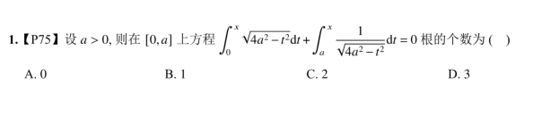

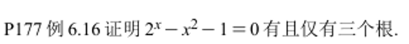

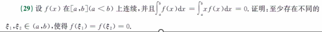

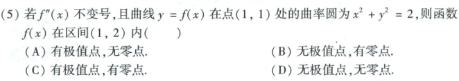

这几题都是讨论零点，或者找零点相关的问题。这类题的破题口就是零点定理。

本质上，讨论零点相关的问题，第一反应一定是零点定理，很多时候，我都会忽视这个最基本的定理，而通过导数，极值等更 “高阶” 的方法去思考，最后就是得不到答案。

诚然，很多题目都需要利用高级的技巧，但本质上都是 “将题设与结果通过某个桥梁联系起来”，而这个联系起来的东西，就是破题。

我们往往非常深度于高级技巧，高级方法，却忽略了最基本的东西。

就好想我在高中阶段那样，深度研究难题，会做难题，却忽略了基本技巧，基本方法，并且在基础部分大量失分。

例如一个看似复杂的三角式，往往只需要通过
$\cos^2 x=1-\sin^2 x$ 进行转化，就可以得到一个非常简单的式子，
而不需要考虑更复杂的二倍角公式、积化和差等。

做不好基础的东西，高级方法的基石就是歪的。

对于应试而言，基础永远是最重要的。

## 第 1 章 - 函数、极限、连续

函数，极限与连续，这个是大学刚入门的时候就开始学的，现在回头来看已经信手拈来。

### 函数及其性态

考研要求的函数范围基本是基本初等函数，这里就不列举了。

主要讲几个关于函数变换的易错点。

- 复合函数

  - 如何求复合函数，最简单的方式是画图，并且一定要搞清楚谁作为定义域，谁作为值域，以及最后的定义域是谁。

    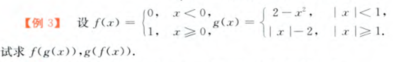

  - 原来的两个函数导数函数不存在，不意味着其复合函数导数不存在。

- 反函数

  在求反函数的时候，主要有两个易错点。

  - 反函数的定义域是原函数的值域，反函数的值域是原函数的定义域。
    所以对于具体的点，题目要你求 $x(0)$，那么一定要注意，这个 $0$ 是
    $y$ 的值，而不是 $x$ 的值。

  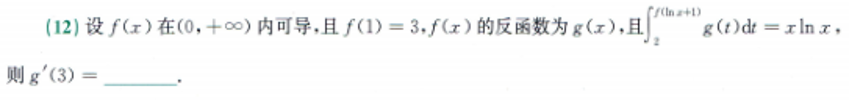

  - 反函数需要注意定义域，关于 $\sin x$ 的反函数，其定义域为
    $\left[-\frac{\pi}{2},\frac{\pi}{2}\right]$，而不是 $(-\infty,\infty)$。

    如果对于定义域 $\left[\frac{\pi}{2},\frac{3\pi}{2}\right]$ 的 $\sin x$，
    以及定义域为 $\left[\frac{3\pi}{2},\frac{5\pi}{2}\right]$ 的 $\sin x$，
    其反函数分别为 $\pi-\arcsin x$ 和 $2\pi+\arcsin x$。

    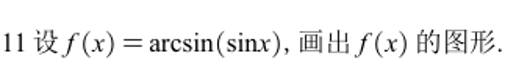

    此外可以注意，对于定义在 $[0,\pi]$ 上的积分，若有 $\arcsin x$ 项，
    令 $x=\sin t$ 时，需要注意上述的转换。当然最后可以用区间再现法规避。

    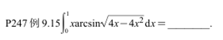

  - 变限函数

    - 变限函数也有两个点需要注意，第一种是如果有 $ x $ ，那么必须利用换元法代换出去，以此又延伸出来两种套路。

      - 如果积分为 $e^{t^2}$，函数上限为 $x^2$，那么一定求导的时候，里面得是 $e^{x^4}$，而不是 $e^{x^2}$。

        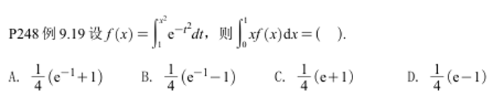

      - 对 $x$ 的函数，对 $t$ 的积分项里面有 $e^x$，可以直接把 $e^x$ 除下去。

    - 变限积分不能全用里面函数的面积去理解，需要结合上下限以及奇偶性去理解。

      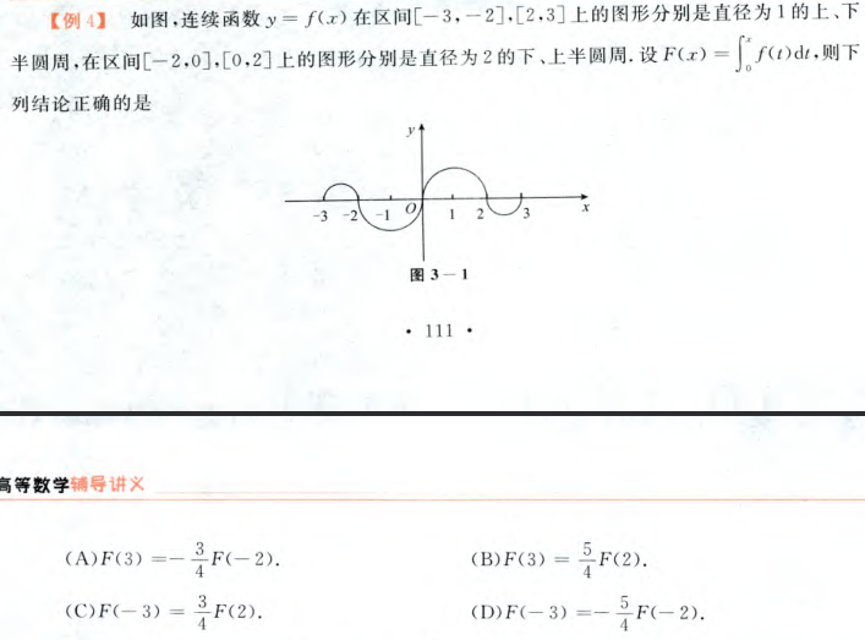

对于上述函数以及基本初等函数，主要讨论函数的性态：单调性，奇偶性，有界性，周期性。

首先来梳理一下这性态相关的易错点。

- 奇函数的导数一定是偶函数，偶函数的导数一定是奇函数。反过来，偶函数的一个原函数不一定是奇函数，奇函数的一个原函数一定可以取为偶函数。

  - 这个知识点还会结合变限积分去考察，对于变限积分，需要注意可以取特值下限为 0 的时候进行讨论

- 原函数有界，导函数不一定有界。例如令 $f(0)=0$，且当 $x\ne0$ 时
  $f(x)=x\sin\frac{1}{x}$，则 $f(x)$ 在 $x=0$ 处有界，但是其导函数
  $f'(x)=\sin\frac{1}{x}-\frac{1}{x}\cos\frac{1}{x}$ 在 $x=0$ 附近无界。

- 在有限区间上，导函数有界，原函数一定有界。

  使用拉格朗日中值定理证明，证明如下：

  设 $f(x)$ 在 $[a,b]$ 上连续，在 $(a,b)$ 上可导，则 $f'(x)$ 在
  $(a,b)$ 上存在一点 $c$，使得 $f'(c)=\frac{f(b)-f(a)}{b-a}$。

  由于 $f'(x)$ 有界，所以在有限区间上 $f(x)$ 一定有界，即原函数一定有界。

- 原函数有周期性，导函数一定有周期性。

- 导函数有周期性，原函数有周期性的充要条件是在一个周期内的积分为 $0$。

### 极限及其相关问题

#### 等价无穷小、高阶无穷小以及泰勒公式

本质上，等价无穷小就是泰勒公式的第一项，所以，只需要掌握以下 8 个泰勒公式即可。

- $\sin x = x - \frac{1}{6}x^3 + o(x^3)$

- $\cos x = 1 - \frac{1}{2}x^2 + \frac{1}{24}x^4 + o(x^4)$

- $\tan x = x + \frac{1}{3}x^3 + o(x^3)$

- $\arcsin x = x + \frac{1}{6}x^3 + o(x^3)$

- $\arctan x = x - \frac{1}{3}x^3 + o(x^3)$

- $e^x = 1 + x + \frac{1}{2}x^2 + \frac{1}{6}x^3 + o(x^3)$

- $\ln(1+x) = x - \frac{1}{2}x^2 + \frac{1}{3}x^3 + o(x^3)$

- $(1+x)^a = 1 + ax + \frac{a(a-1)}{2}x^2 + o(x^2)$

尤其要注意正负号问题。

关于高阶无穷小有一个问题，如果 $f(x)$ 是 $g(x)$ 的高阶无穷小，那么
$f(x)=o(g(x))$，用极限表达也就是
$\lim_{x\to0}\frac{f(x)}{g(x)}=0$。

> **校验：** 以上展开式使用等号表示带余项的泰勒展开；若只保留首项，
> 才写作等价无穷小，例如 $\sin x\sim x$。

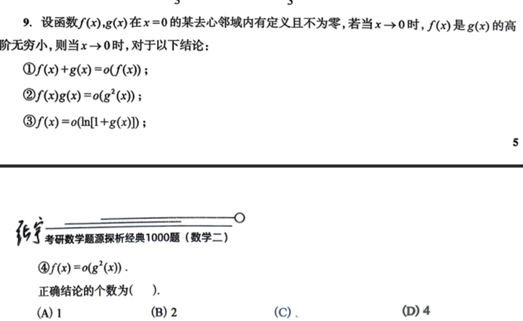

此外还需要注意等价无穷小和等价无穷大（没有这个概念，只是类比）的区别。

假设 $m>n$，且相关幂函数在所讨论的定义域内有意义，那么当 $x\to0^+$ 时，
$x^m+x^n\sim x^n$；当 $x\to+\infty$ 时，$x^m+x^n\sim x^m$。

#### 给定极限计算

方法流程

1. 判断属于 7 种未定式中的哪一种。
2. 基础变形，利用等价无穷小
3. （可选）泰勒公式
4. （可选）拉格朗日中值定理（可能要利用夹逼定理）
5. 必要时使用泰勒公式（需要注意能不能求导）。

#### 给定极限求参数

往往利用泰勒公式可以迎刃而解。

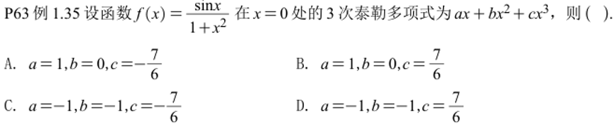

#### 洛必达法则

洛必达法则适用于 $\frac{0}{0}$ 和 $\frac{\infty}{\infty}$ 型未定式；
在适当条件下，分子有有限极限时也可以处理 $\frac{A}{\infty}$ 型极限。

洛必达法则可以用柯西中值定理证明。

这里写一下关于洛必达法则的辨析：如果一个函数在所需邻域内足够光滑，
并且每次都满足洛必达法则的适用条件，才可以连续使用多次；不能仅凭“$n$
阶可导”就直接洛 $n-1$ 次。

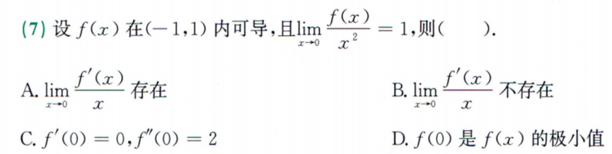

### 连续

#### 函数的极限存在与连续的辨析

函数极限存在：函数左侧极限与右侧极限存在且相等。

函数连续：函数极限存在且等于函数值，也就是函数左侧极限等于右侧极限等于函数值。

这点需要辨析，推导至导函数的连续性也是一样的。

#### 间断点分类

第一类间断点：可去间断点，跳跃间断点。

第二类间断点（考研范围）：无穷间断点，震荡间断点。

这里主要是注意两个经典函数：$e^{1/x}$，$\arctan\frac{1}{x}$。

对于 $e^{1/x}$，当 $x\to0^+$ 时，极限值趋于无穷大，当 $x\to0^-$
时，极限值趋于 $0$，所以是第二类间断点。

对于 $\arctan\frac{1}{x}$，当 $x\to0^+$ 时，极限值趋于 $\frac{\pi}{2}$，
当 $x\to0^-$ 时，极限值趋于 $-\frac{\pi}{2}$，所以是跳跃间断点。

此外还需要注意不要混淆可去间断点与跳跃间断点，题目里可能会问可去 / 跳跃 / 第一类 / 无穷 等等，一定要注意限制词。

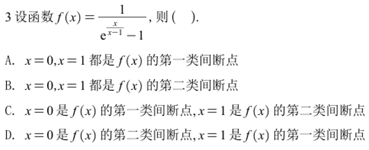

#### 零点定理，介值定理

零点定理和介值定理不会很难，最重要的问题就是分析范式不严谨导致遗忘这两个方法。

还可以注意一下介值定理的变形，平均值定理。

此外，还需要注意利用极限的定义进行讨论（例如在端点非常近的区间等，典型的代表是证明达布定理）。

## 第 2 章 - 数列极限

### 数列极限的定义

数列极限的定义为：对于任意 $\epsilon>0$，存在 $N\in\mathbb{N}$，
使得当 $n>N$ 时，有 $|a_n-a|<\epsilon$。

需要注意的是，数列极限的 n 默认为正无穷。并且还有一点需要注意，如果要求极限，那么需要将 n 转换为 x，然后 x 趋近于正无穷。

数列极限常用的性质有 3 个：保号性、保序性、有界性。

- 保号性：若 $a_n\to a$ 且 $a\ne0$，则从某一项起，数列的项都与极限同号。
- 保序性：若从某一项起 $a_n\le b_n$，且两列极限都存在，则
  $\lim_{n\to\infty}a_n\le\lim_{n\to\infty}b_n$。
- 有界性：收敛数列一定有界。

### 数列定义的选择题

#### 常见特值与构造思路

- 常见特殊数列

  - $a_n$ 的奇数项为 $0$，偶数项为 $1$，等等

  - $a_n=(-1)^n\frac{1}{n}+1$

- 构造思路

  - 数列的奇数项和偶数项极限如果不同，那么原数列极限不存在。

#### 夹逼定理与一个经典极限

- 经典极限定理
  
  当 $a_n\to a$ 时，$|a_n|\to|a|$，可以使用数列极限的定义以及三角不等式进行证明。

  其中特别地，当 $a=0$ 时，后者也可以推出前者，即 $|a_n|\to0$ 可以推出 $a_n\to0$。

- 夹逼定理

  夹逼定理有两类应用，第一种为 n 项数列求和，如果自变量的量级 < n 的量级，那么大概率使用夹逼定理，否则可以考虑使用定积分的定义。

  第二种是证明极限存在的部分步骤，例如证明二元函数的极限，证明压缩映射定理等。

#### 保序性的应用

定义一个数列为 $a_n=(-1)^n\frac{1}{n}+1$，那么该数列是否存在最大值？是否存在最小值？

列出第 2 项，显然为 $\frac{3}{2}$；列出第 3 项，显然为 $\frac{2}{3}$。
由于当 $n$ 趋于无穷时，该极限为 $1$，所以后无穷项都落在 $1$ 的附近。
取前若干项，则一定存在最大值和最小值。

### 数列极限的证明

#### 单调有界准则

如果一个数列单调递增有上界，那么该数列必然存在极限。

如果一个数列单调递减有下界，那么该数列必然存在极限。

- 单调性的证明

  - 定义法：使用 $x_{n+1}-x_n$ 的符号来判断单调性。

  - 导数法：$x_n=f(x_{n-1})$，如果 $f'(x)>0$，且

    - 如果 $x_1<x_2$，那么 $x_n$ 是单调递增的。
    - 如果 $x_1>x_2$，那么 $x_n$ 是单调递减的。

    如果 $f'(x)<0$，那么无法仅凭此判断 $x_n$ 的单调性。

  - 数学归纳法：显然看出。

- 有界性的证明

  - 定义法：使用 $|x_n|<M$ 来证明有界性。

  - 不等式法

得到了单调有界后，那么直接两边同时取极限，即可得到答案。

#### 压缩映射原理

事实上压缩映射原理不能直接用，考研大纲里面没有。

如果发现该数列不能证明出来单调有界，那么就该考虑使用类似压缩映射的原理去证明。

这类题的基本套路是：先两边同时取极限，得到这个值之后，利用定义 + 夹逼定理去证明这个极限存在。

也就是不妨设
$0<|x_n-a|<b|x_{n-1}-a|<b^2|x_{n-2}-a|
<\cdots<b^{n-1}|x_1-a|$，其中 $0<b<1$，那么根据夹逼定理，
$x_n$ 的极限为 $a$。

> **校验：** 这里还需要先证明不等式对所有充分大的 $n$ 成立，不能只由形式上的递推不等式直接断定极限存在。

## 第 3 章 - 一元函数微分概念

### 导数的定义

导数的定义为
$f'(x_0)=\lim_{h\to0}\frac{f(x_0+h)-f(x_0)}{h}$，可以变形为
$f'(x_0)=\lim_{x\to x_0}\frac{f(x)-f(x_0)}{x-x_0}$。

这里除了利用导数的定义倒腾来倒腾去之外（例如拆分，配凑导数定义），还有一类题。

若 $h(x)=f(x)g(x)$，求 $h'(0)$ 可以用 $uv$ 的公式，或者使用导数的定义。

### 关于导数以及导数绝对值的讨论

- 对于 $ g(x)=f(x)|x-a| $ 可导性的讨论

  在 $f$ 在 $a$ 处可导的前提下，$f(a)=0$ 是 $g(x)$ 在 $a$ 点可导的充分必要条件。

  在做这种题的时候，要注意 $ f(x) $ 本身可能有多个不可导点。

- 关于 $ f(x) $ 和 $ |f(x)| $ 可导性的讨论

  对于这种题，绘图是最简单的做法，其次才利用下面的结论。

  若 $f(x_0)\ne0$ 且 $f$ 在 $x_0$ 处可导，则 $|f(x)|$ 在 $x_0$ 处可导。

  若 $f(x_0)=0$ 且 $f$ 在 $x_0$ 处可导，若 $f'(x_0)=0$，则 $|f(x)|$ 在 $x_0$ 处可导。

  若 $f(x_0)=0$ 且 $f$ 在 $x_0$ 处可导，若 $f'(x_0)\ne0$，则 $|f(x)|$ 在 $x_0$ 处不可导。

  若 $f$ 在 $x_0$ 处连续，且 $|f(x)|$ 在 $x_0$ 处可导，
  则 $f(x)$ 在 $x_0$ 处可导。

  > **校验：** 上述结论还需要 $f$ 在 $x_0$ 处连续；仅知道 $|f|$
  > 在 $x_0$ 处可导，不能推出 $f$ 在 $x_0$ 处可导。

### 微分的定义

微分的定义为 $\mathrm{d}y=f'(x_0)\,\mathrm{d}x$。若 $\mathrm{d}x=x-x_0$，
则 $\mathrm{d}y=f'(x_0)(x-x_0)$。考的不是很多，但是也需要注意。

> **校验：** 后一个式子隐含了 $\mathrm{d}x=x-x_0$ 的约定；一般形式不能
> 遗漏 $\mathrm{d}x$。

比较常见的是考 m 是 n 的高阶无穷小 / 等价无穷小 / 同阶无穷小 / 低阶无穷小。

## 第 4 章 - 一元函数微分计算

### 需要注意的求导公式

- $\left(\sec x\right)'=\sec x\tan x$
- $\left(\csc x\right)'=-\csc x\cot x$
- $\left(\arcsin x\right)'=\frac{1}{\sqrt{1-x^2}}$
- $\left(\arccos x\right)'=-\frac{1}{\sqrt{1-x^2}}$
- $\left(\arctan x\right)'=\frac{1}{1+x^2}$
- $\left(\log_a x\right)'=\frac{1}{x\ln a}$
- $\left(a^x\right)'=a^x\ln a$

### 隐函数求导

隐函数求导的本质是对方程两边同时求导，然后解出导数，要注意对每个作为变量的都求导。

### 对数求导法

对数求导法的本质是对方程两边同时取对数，然后对方程两边同时求导，是一种化简手段，本质上其实是对多个连乘式子的化简。

### 复合函数求导

复合函数求导的本质是链式法则，要注意对每个作为变量的都求导。

尤其还可以注意，对于单点可以直接利用复合函数求导法的公式。

即 $(f\circ g)'(x_0)=f'(g(x_0))g'(x_0)$。

### 反函数求导

反函数求导的本质是反函数定理，即
$(f^{-1})'(x)=\frac{1}{f'(f^{-1}(x))}$。

不需要记忆反函数求导的二阶导数，在考场上利用定义现场推导即可，这里也写一下推导：

$(f^{-1}(x))''=-\frac{f''(f^{-1}(x))}
{(f'(f^{-1}(x)))^3}$

### 参数方程求导

参数方程求导一定要搞清楚求导的对象，到底是 x 还是 t。

$\frac{\mathrm{d}y}{\mathrm{d}x}
=\frac{\mathrm{d}y/\mathrm{d}t}{\mathrm{d}x/\mathrm{d}t}$

$\frac{\mathrm{d}^2y}{\mathrm{d}x^2}
=\frac{\mathrm{d}}{\mathrm{d}t}
\left(\frac{\mathrm{d}y}{\mathrm{d}x}\right)
\bigg/\frac{\mathrm{d}x}{\mathrm{d}t}$

同样的，考场上不需要特地去背公式，现场推导即可。

此外，参数方程求导还可以注意结合隐函数求导，乃至反套路，即将参数方程化为原函数进行讨论。

例如已知 $x=t^2+|t|$，$y=t^3$，讨论 $f(x)$ 的连续性、可导性和极值。

对于这类题，可以将参数方程化为原函数进行讨论。在讨论极值的时候，
必须要注意 $x$ 和 $t$ 是否一一对应。

例如 $x=t^3-t$，当 $x>0$ 时，$x$ 和 $t$ 并非一一对应，需要额外讨论。

## 第 5 章 - 一元函数微分应用 1（渐近线）

### 极值与拐点

#### 极值

判断极值的条件有：第一充分条件，第二充分条件，第三充分条件。

第一充分条件：若 $f'(x_0)=0$，且 $f'(x)$ 在 $x_0$ 两侧变号，
则 $f(x)$ 在 $x_0$ 处有极值。

第二充分条件：若 $f'(x_0)=0$，且 $f''(x_0)\ne0$，
则 $f(x)$ 在 $x_0$ 处有极值。

第三充分条件：若 $f'(x_0)=\cdots=f^{(n)}(x_0)=0$，
且 $f^{(n+1)}(x_0)\ne0$，且 $n$ 为奇数，则 $f(x)$ 在 $x_0$ 处有极值。

#### 拐点

判断拐点的条件有：第一充分条件、第二充分条件、第三充分条件。

第一充分条件：若 $f''(x)$ 在 $x_0$ 两侧变号，则 $f(x)$ 在 $x_0$ 处有拐点。

第二充分条件：若 $f''(x_0)=0$，且 $f'''(x_0)\ne0$，
则 $f(x)$ 在 $x_0$ 处有拐点。

第三充分条件：若 $f''(x_0)=\cdots=f^{(n)}(x_0)=0$，
且 $f^{(n+1)}(x_0)\ne0$，且 $n$ 为偶数，则 $f(x)$ 在 $x_0$ 处有拐点。

需要注意，对于上述极值和拐点的条件，一定要注意“附近”。
并没有规定说 $f'(x_0)=f''(x_0)=0$ 就说明极值点不存在，
还是得从第一充分条件去判断。

拐点同理。

### 导数为 0 的相关讨论

$f'(x_0) = 0$ 只是函数取得极值的必要条件（费马引理，要求可导），绝对不是充分条件。

导数为 0 的点称为驻点。驻点可能是极值点，也可能是拐点（非极值点）。

必须加上导数在 $x_0$ 两侧发生变号，或偶数阶导数不为 $0$
的判定条件，才能确保它是极值点。

例如：$f(x) = x^3$

### 高阶导数

利用泰勒公式即可，尤其需要注意当 $ x=0 $ 的时候意义是什么。

### 渐近线

渐近线分为三种，水平渐近线，垂直渐近线，斜渐近线。

水平渐近线：当 $x\to\infty$ 时，$f(x)\to a$，则 $y=a$ 为水平渐近线。

垂直渐近线：当 $x\to x_0$ 时，$f(x)\to\infty$，则 $x=x_0$ 为垂直渐近线。

斜渐近线：当 $x\to\infty$ 时，$\frac{f(x)}{x}\to k$，
且 $f(x)-kx\to b$，则 $y=kx+b$ 为斜渐近线。

> **校验：** 斜渐近线的定义应使用 $f(x)$ 在无穷远处的行为，
> 不能把自变量写成 $\frac{1}{x}$。

对于这种题，首先找出可能的候选人，然后逐个分析，尤其需要注意前面所说的
$\arctan x$ 以及 $e^{1/x}$ 等。

### 曲率

为比较冷门的考点，但是也必须要注意。

曲率公式为 $k=\frac{|f''(x)|}{\left(1+(f'(x))^2\right)^{3/2}}$。

曲率半径为 $\rho=\frac{1}{k}$。

曲率圆为该点沿着法线向着内侧移动 $ \rho $ 个单位，然后绘制圆。

对曲率圆求导和求二阶导的数值等同于原函数求导和求二阶导的数值。

## 第 6 章 - 一元函数微分应用 2（中值定理）

### 费马定理

如果函数是极值，那么导数为 0（或不存在）。

### 达布定理

本质是导数介值定理。

### 罗尔定理

罗尔定理的形式为：对于函数 $f(x)$，在 $[a,b]$ 上连续、
在 $(a,b)$ 上可导，且 $f(a)=f(b)$，那么存在 $c\in(a,b)$，
使得 $f'(c)=0$。

对于罗尔定理的题正是利用不停重复的去找零点，也就是要证式的积分找 2 零点，如果找不到，那么就再往上一层。

这个再往上一层的思想很重要。

如果原函数找不到，可以用微分方程去找。

### 罗尔定理的推论

如果 $f(x)$ 的 $n$ 阶导数为非零常量，那么 $f(x)$ 至多有 $n$ 个零点。

该定理也被经常遗忘。

### 拉格朗日中值定理 & 柯西中值定理

拉格朗日中值定理的形式为：对于函数 $f(x)$，在 $[a,b]$ 上连续、
在 $(a,b)$ 上可导，那么存在 $c\in(a,b)$，使得
$f'(c)=\frac{f(b)-f(a)}{b-a}$。

拉格朗日中值定理可以用罗尔定理去证明，其实质就是罗尔定理的推广。

证明如下：

令 $g(x)=f(x)-\frac{f(b)-f(a)}{b-a}(x-a)$，那么
$g(a)=g(b)=0$，所以存在一个 $c\in(a,b)$，使得 $g'(c)=0$。

即 $ f'(c) = \frac{f(b) - f(a)}{b - a} $。

所以拉格朗日中值定理得证。

柯西中值定理的形式为：对于函数 $f(x)$ 和 $g(x)$，在 $[a,b]$
上连续、在 $(a,b)$ 上可导，且 $g'(x)\ne0$，那么存在 $c\in(a,b)$，
使得 $\frac{f'(c)}{g'(c)}
=\frac{f(b)-f(a)}{g(b)-g(a)}$。

拉格朗日中值定理的题有两种，一种是证明两个点，即 c1，c2 在某区间里，且 c1 没说必须不等于 c2，另一种则是明确了 c1 和 c2 必须不等于对方。

对于前者，利用拉格朗日中值定理 + 柯西中值定理可以解决。

对于后者，可以利用“踩点”的思想，即若 $f(x)$ 在 $[a,b]$ 上连续、
在 $(a,b)$ 上可导，那么可以在 $(a,b)$ 内找到一个点 $c$，并且分别在
$[a,c]$、$[c,b]$ 上使用拉格朗日中值定理，最后使用介值定理得到结论。

此外，对于拉格朗日中值定理的题目，可以适当的从中间取一个点，分区间进行讨论。

### 使用泰勒公式证明中值定理

首先辨析一下泰勒公式的皮亚诺余项和拉格朗日余项。

皮亚诺余项为 $o(x^n)$，拉格朗日余项为
$\frac{f^{(n+1)}(c)}{(n+1)!}x^{n+1}$。

对于皮亚诺余项，常用于讨论单点的性质；对于拉格朗日余项，常用于讨论函数，区间的性质。

所以在证明中值定理相关问题的时候，一般用皮亚诺余项。

对于题设给定的条件，通常选择信息量最多，或者最好约去的点进行展开。

有的时候，并不是对已知点展开，可能是对未知点展开。

代入具体值的时候，可以选择代入多个点进行对比讨论。

此外，有一个易错点：若将 $\sin x$ 展开到一次项，
其拉格朗日余项为 $-\frac{\sin c}{2!}x^2$，并不恒为 $0$。

> **校验：** 这里的负号来自 $\sin x$ 的二阶导数
> $-\sin x$；若展开到二次项，余项阶数应改为三阶。

## 第 7 章 - 一元函数微分应用 3（物理）

关于物理应用，现在这个阶段再回头去看，已经基本明晰了。

本质上就是搞清楚 $\mathrm{d}y/\mathrm{d}x$ 的含义，然后对
$\mathrm{d}y/\mathrm{d}x$ 进行变形，直到得到目标值。

## 第 8 章 - 一元函数积分的概念

### 积分的黎曼和定义

和使用夹逼定理不同的，对于一串 $ a_n $ 的和，如果自变量的变化和 $ n $ 的次数是相同的，那么就可以使用一元积分的定义。

常见的是在区间 $[0,1]$ 上：

$$
\lim_{n\to\infty}\frac{1}{n}\sum_{i=1}^{n}
f\left(\frac{i}{n}\right)=\int_{0}^{1}f(x)\,\mathrm{d}x
$$

除了常见的，还需要去理解下面的。

事实上，应该这么理解定义：底边边长和采样点。对于区间 $[u,v]$，
假设分为 $n$ 份，那么底边边长自然是 $\frac{v-u}{n}$，
而采样点则是 $u+\frac{(v-u)i}{n}$。

$$
\lim_{n\to\infty}\sum_{i=1}^{n}
f\left(u+i\cdot\frac{v-u}{n}\right)\cdot\frac{v-u}{n}
=\int_{u}^{v}f(x)\,\mathrm{d}x
$$

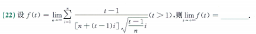

### 积分概念辨析

原函数、定积分、不定积分、变限积分、反常积分。

- 原函数：导函数具有介值性，因此可以不连续，但不能出现跳跃间断。

  构造函数

  $$
  f(x)=
  \begin{cases}
  2x\sin\frac{1}{x^2}-\frac{2}{x}\cos\frac{1}{x^2}, & x\ne0,\\
  0, & x=0,
  \end{cases}
  $$

  其原函数为

  $$
  F(x)=
  \begin{cases}
  x^2\sin\frac{1}{x^2}, & x\ne0,\\
  0, & x=0.
  \end{cases}
  $$

  比如这个函数存在原函数。

- 定积分：若指黎曼可积，则函数必须有界，且间断点集合的长度为
  $0$；不要求连续，也不要求只有有限个间断点。

  例如上面那个函数在区间 $[-1,2]$ 上无界，因此不存在黎曼定积分。

  > **校验：** “定积分存在就连续且只有有限个间断点”并不成立；
  > 连续是充分条件，但不是黎曼可积的必要条件。

- 原函数与不定积分：不定积分指的是原函数族

- 变限积分：变限积分是一个函数，其定义域是积分上限的取值范围。

- 反常积分：反常积分要注意处理瑕点，然后分区间进行讨论。

### 积分不等式

在区间 $(0,\pi/2)$ 上，$\sin x<x<\tan x$。

在区间 $(0,\pi/2)$ 上，$\sin x>\frac{2}{\pi}x$。

在区间 $(0,\pi/4)$ 上，$\frac{4}{\pi}x>\tan x$。

对于式子 1 可以用导数证明，对于式子 2 和 3，可以利用几何意义证明。

### 反常积分与 p 积分

其实对于数 2 一般利用 p 积分进行讨论（因为没有无穷级数）。

给出一道构造的题：

$$
I=\int_{0}^{+\infty}
\frac{1}{x^p|x-1|^{2p}(1+x^2)^p}\,\mathrm{d}x
$$

其等价为：

$$
I=\int_{0}^{1/2}f(x)\,\mathrm{d}x
+\int_{1/2}^{1}f(x)\,\mathrm{d}x
+\int_{1}^{2}f(x)\,\mathrm{d}x
+\int_{2}^{+\infty}f(x)\,\mathrm{d}x
$$

需要注意的是，这里的 1/2 和 2 都是随便挑的点，没有其他什么特别的含义。

对于这类题，首先根据可能导致无定义的点进行拆开，然后趋近于这个无定义的点，先利用极限化简，然后根据 p 积分讨论。

- 第一类：无穷区间型 $p$-积分（无穷限反常积分）

  设常数 $a > 0$，标准形式为：$\int_{a}^{+\infty} \frac{1}{x^p} \, dx$，敛散性结论：
  $$
  \begin{cases}
  \text{积分收敛，值为 }\dfrac{a^{1-p}}{p-1}, & p>1,\\
  \text{积分发散}, & p\le1.
  \end{cases}
  $$

- 第二类：有限区间瑕积分型 $p$-积分（无界函数瑕积分）

  (1) 瑕点在下限 $x=a$（例如原点 $a=0$），设 $b>a$，形式为：
  $\int_{a}^{b}\frac{1}{(x-a)^p}\,\mathrm{d}x$（特别当 $a=0$ 时即为
  $\int_{0}^{b}\frac{1}{x^p}\,\mathrm{d}x$），敛散性结论：
  $$
  \begin{cases}
  \text{积分收敛，值为 }\dfrac{(b-a)^{1-p}}{1-p}, & p<1,\\
  \text{积分发散}, & p\ge1.
  \end{cases}
  $$

  (2) 瑕点在上限 $x = b$，设 $b > a$，形式为：$\int_{a}^{b} \frac{1}{(b-x)^p} \, dx$，敛散性结论：
  $$
  \begin{cases}
  \text{积分收敛，值为 }\dfrac{(b-a)^{1-p}}{1-p}, & p<1,\\
  \text{积分发散}, & p\ge1.
  \end{cases}
  $$

关于 $p$ 积分，需要注意的是如果讨论区间是 $[0,1]$，且 $0$ 和 $1$
都是瑕点，那么对于 $0$ 显然是利用第二类 $p$ 积分的第一种，对于 $1$，
不要用成第一类 $p$ 积分了，一定是第二类 $p$ 积分的第二种。

此外需要注意题干条件，题干本身可能就会对一些数值做出限制。

## 第 9 章 - 一元函数积分的计算

### 基本积分公式

$C$ 要记得。

### 积分计算方法

配凑法，换元法，分部积分，都是比较基础的。

### 利用奇偶性与周期性进行定积分的化简

1. 对称区间 $[-a,a]$ 的奇偶性化简。

   设 $f(x)$ 在 $[-a,a]$ 上可积：

   $$
   \int_{-a}^{a}f(x)\,\mathrm{d}x=
   \begin{cases}
   0, & f(x)\text{ 为奇函数},\\
   2\displaystyle\int_{0}^{a}f(x)\,\mathrm{d}x,
   & f(x)\text{ 为偶函数}.
   \end{cases}
   $$

2. 周期函数的积分化简。
设 $f(x)$ 是以 $T$ 为周期的连续函数：

区间平移不变性：任意实数 $a$，都有：

$$
\int_{a}^{a+T}f(x)\,\mathrm{d}x
=\int_{0}^{T}f(x)\,\mathrm{d}x
$$
多周期分解：
$$
\int_{0}^{nT}f(x)\,\mathrm{d}x
=n\int_{0}^{T}f(x)\,\mathrm{d}x
\quad(n\in\mathbb{Z})
$$
一般区间：

$$
\int_{a}^{a+nT}f(x)\,\mathrm{d}x
=n\int_{0}^{T}f(x)\,\mathrm{d}x
$$

### 有理函数的积分

对于有理分式 $R(x)=\frac{P(x)}{Q(x)}$：

假分式化为真分式：若分子次数 $\ge$ 分母次数，通过多项式除法拆为：多项式 + 真分式。
分母因式分解：实数域内 $Q(x)$ 分解为一次因式 $(x-a)^k$
与二次质因式 $(x^2+px+q)^m$。
待定系数拆分原则：
$$
\begin{aligned}
\frac{P(x)}{Q(x)}
&=\sum_{j=1}^{k}\frac{A_j}{(x-a)^j}\\
&\quad+\sum_{j=1}^{m}
\frac{B_jx+C_j}{(x^2+px+q)^j}
\end{aligned}
$$
逐项积分：

一次项对应生成对数函数 $\ln|x-a|$，高次项对应负幂次函数。
二次项通过配方为
$\left(x+\frac{p}{2}\right)^2+\left(q-\frac{p^2}{4}\right)$，
结合凑微分法分别积出对数与反正切 $\arctan$。

这个不算难，但是会轻视和遗忘。

### 华理士公式

定义

$$
I_n=\int_{0}^{\pi/2}\sin^n x\,\mathrm{d}x
=\int_{0}^{\pi/2}\cos^n x\,\mathrm{d}x,
\quad n\in\mathbb{N}^+.
$$

$$
I_n=
\begin{cases}
\dfrac{n-1}{n}\cdot\dfrac{n-3}{n-2}\cdots
\dfrac{1}{2}\cdot\dfrac{\pi}{2}, & n\text{ 为正偶数},\\[6pt]
\dfrac{n-1}{n}\cdot\dfrac{n-3}{n-2}\cdots
\dfrac{2}{3}\cdot1, & n\text{ 为正奇数}.
\end{cases}
$$

如果区间变成其他的，可以通过奇偶性进行转换。

### 区间再现

碰到三角函数相关的积分计算，一定是要先想到区间再现。

对任意连续函数 $f(x)$，令 $t=a+b-x$：

$$
\int_{a}^{b}f(x)\,\mathrm{d}x
=\int_{a}^{b}f(a+b-x)\,\mathrm{d}x
$$
进而推导出“自加平均法”：
$$
I=\int_{a}^{b}f(x)\,\mathrm{d}x
=\frac{1}{2}\int_{a}^{b}
\bigl[f(x)+f(a+b-x)\bigr]\,\mathrm{d}x
$$

$$
\int_{0}^{\pi}xf(\sin x)\,\mathrm{d}x
=\frac{\pi}{2}\int_{0}^{\pi}f(\sin x)\,\mathrm{d}x
$$

### 变限积分 + 极限

需要注意换元。

若 $\Phi(x)=\int_{\alpha(x)}^{\beta(x)}f(t)\,\mathrm{d}t$，其中 $f(t)$
连续，$\alpha(x),\beta(x)$ 可导，则：

$$
\Phi'(x)=f(\beta(x))\beta'(x)-f(\alpha(x))\alpha'(x)
$$

若被积函数内部同时包含积分变量 $t$ 和外层极限/求导变量 $x$
（如 $F(x)=\int_{a}^{b(x)}f(x,t)\,\mathrm{d}t$）：

绝不可直接套用公式求导。

- 策略 1（因式分离）：若能提纯，例如
  $\int_{a}^{x}(x-t)f(t)\,\mathrm{d}t
  =x\int_{a}^{x}f(t)\,\mathrm{d}t-\int_{a}^{x}tf(t)\,\mathrm{d}t$，
  拆开后再求导。
- 策略 2（换元消除）：若 $x$ 混在复合函数内（如 $f(x-t)$ 或 $f(xt)$），
  必须先做换元令 $u=\varphi(x,t)$，将参变量 $x$ 转移至积分上下限
  或系数中，再行求导或利用 L'Hôpital 法则求极限。

## 第 10 章 - 一元函数积分的应用 1（几何应用）

### 计算面积

面积计算其实没什么好说的，注意计算就好了。

可以注意以下三点：

- $x$ 和 $y$ 坐标系：必要的时候可以交换。
- 参数方程：当成换元法去理解。
- 极坐标：也当成换元法去理解。

### 计算体积

不要去背任何公式，使用二重积分的方法去理解，也就是：

$$
\mathrm{d}V=2\pi r(x,y)\,\mathrm{d}\sigma
=2\pi\frac{|Ax+By+C|}{\sqrt{A^2+B^2}}\,\mathrm{d}x\,\mathrm{d}y
$$

可以注意，这个公式不要忘了 $2\pi$，本质上是圆的周长公式。

> **校验：** 这个体积公式使用了帕普斯定理，旋转轴应与区域相离；
> 若旋转轴穿过区域，需要分割区域或改用直接积分。

### 计算弧长与侧面积

弧长公式通常为：

$$
L=\int_{a}^{b}\sqrt{1+\bigl(f'(x)\bigr)^2}\,\mathrm{d}x
$$

参数方程的弧长公式为：

$$
L=\int_{a}^{b}\sqrt{\bigl(x'(t)\bigr)^2+\bigl(y'(t)\bigr)^2}\,\mathrm{d}t
$$

极坐标方程的弧长公式为：

$$
L=\int_{a}^{b}\sqrt{r^2(t)+\bigl(r'(t)\bigr)^2}\,\mathrm{d}t
$$

使用上述弧长公式的时候，一定要注意不要忘了平方。

绕 x 轴的侧面积：

$$
S=\int_{a}^{b}2\pi y(x)
\sqrt{1+\bigl(y'(x)\bigr)^2}\,\mathrm{d}x
$$

绕 y 轴的侧面积：

$$
S=\int_{a}^{b}2\pi x(y)
\sqrt{1+\bigl(x'(y)\bigr)^2}\,\mathrm{d}y
$$

稍微通用一点，可以理解为：

$$
S=\int_{L}2\pi r(x,y)\,\mathrm{d}s
=\frac{2\pi}{\sqrt{A^2+B^2}}
\int_{L}|Ax+By+C|\,\mathrm{d}s
$$

注意 $r(x,y)$ 是点到旋转轴的距离。

此外需要注意，在计算侧面积的时候，需要看题设。题设可能是求整体面积，需要加上底面积。

### 形心

$$
\bar{x}=\frac{1}{S}\iint_Dx\,\mathrm{d}x\,\mathrm{d}y,
\qquad
\bar{y}=\frac{1}{S}\iint_Dy\,\mathrm{d}x\,\mathrm{d}y,
\qquad
S=\iint_D\mathrm{d}x\,\mathrm{d}y
$$

其中 $S$ 为区域 $D$ 的面积。

为冷门考点，但需要掌握。

## 第 11 章 - 一元函数积分的应用 2（中值定理）

### 积分绝对值不等式

$$
\left|\int_{a}^{b}f(x)\,\mathrm{d}x\right|
\le\int_{a}^{b}|f(x)|\,\mathrm{d}x
$$

### 积分的最大值最小值定理

设函数 $f(x)$ 在闭区间 $[a,b]$（$a<b$）上连续，且 $m$ 和 $M$
分别为 $f(x)$ 在 $[a,b]$ 上的最小值与最大值，即：

$$
m\le f(x)\le M,\qquad \forall x\in[a,b]
$$
则有以下不等式成立：

$$
m(b-a)\le\int_{a}^{b}f(x)\,\mathrm{d}x\le M(b-a)
$$

可以使用积分的保号性证明。

### 积分中值定理

积分中值定理有两种区间形式，一种是利用积分最大值最小值定理证明，另一种是利用拉格朗日中值定理证明。

利用积分最大值最小值定理：

$$
m(b-a)\le\int_{a}^{b}f(x)\,\mathrm{d}x\le M(b-a)
$$
因为 $b - a > 0$，两边同除以 $(b - a)$：
$$
m\le\frac{1}{b-a}\int_{a}^{b}f(x)\,\mathrm{d}x\le M
$$
记该平均值为
$\mu=\frac{1}{b-a}\int_{a}^{b}f(x)\,\mathrm{d}x$。
因为 $f(x)$ 在闭区间 $[a,b]$ 上连续，由介值定理，必存在至少一点
$\xi\in[a,b]$，使得：

$$
f(\xi)=\mu=\frac{1}{b-a}\int_{a}^{b}f(x)\,\mathrm{d}x
$$
两边同乘 $(b - a)$，即得：
$$
\int_{a}^{b}f(x)\,\mathrm{d}x=f(\xi)(b-a),
\qquad \xi\in[a,b]
$$

构造变上限积分辅助函数：
$$
F(x)=\int_{a}^{x}f(t)\,\mathrm{d}t,
\qquad x\in[a,b]
$$
因为 $f(x)$ 在 $[a, b]$ 上连续，由微积分基本定理可知：

$F(x)$ 在闭区间 $[a, b]$ 上连续；
$F(x)$ 在开区间 $(a,b)$ 内可导，且导函数 $F'(x)=f(x)$。

利用拉格朗日中值定理：

对函数 $F(x)$ 在 $[a, b]$ 上应用拉格朗日中值定理，必存在至少一点 $\xi \in (a, b)$，使得：
$$
F(b)-F(a)=F'(\xi)(b-a)
$$
代入 $F(b)=\int_{a}^{b}f(t)\,\mathrm{d}t$、
$F(a)=\int_{a}^{a}f(t)\,\mathrm{d}t=0$ 以及 $F'(\xi)=f(\xi)$，
立即得到：

$$
\int_{a}^{b}f(x)\,\mathrm{d}x=f(\xi)(b-a),
\qquad \xi\in(a,b)
$$

### 利用变上限积分证明

变限积分的难点在于遗忘，很多时候想不到可以用变限积分。

此外，如果变限积分内部有绝对值，那么遵循有绝对值拆绝对值，必须先拆绝对值。

### 结合微分中值定理 / 泰勒公式证明

那么此时，积分一般只是作为题目的一步，只是辅助，例如为罗尔定理找点等。

### 分部积分证明中值定理

在上面那条路走不通的时候，往往是利用换元法 + 分部积分来证明。

## 第 12 章 - 一元函数积分的应用 3（物理应用）

### 抽水做功

不需要背任何公式，考场现推。

$$
W=Fs
$$

$$
F=mg
$$

$$
m=\rho V
$$

$$
V=Sh
$$

然后具体题目具体分析，一般是把 $h$ 和 $s$ 代换为 $y$ 相关的式子，
$S$ 代换为 $x$ 相关的式子。

需要注意的是，s 是距离，且抽水做功是克服重力做功，而不是对压力做功。

### 压力

不需要背任何公式，考场现推。

$$
F=PS
$$

$$
P=\rho gh
$$

可以得到 $F=\rho ghS$，然后具体题目具体分析，这个 $S$ 是面积，
一般是 $x=g(y)$，这个 $h$ 是高，积分的时候一般是把 $h$ 替换为
$y$ 等变量。

### 引力以及引力做功

首先利用引力公式求出引力，然后利用抽水做功那套的推导去计算做功。

引力公式为：

$$
F=\frac{Gm_1m_2}{r^2}
$$

其中 $ G $ 是引力常数，$ m_1 $ 和 $ m_2 $ 是两个物体的质量，$ r $ 是两个物体之间的距离。

在计算引力的时候，需要注意引力的方向。

## 第 13 章 - 多元函数微分学

### 多元函数极限与连续

解题流程：

1. 判断次数。对于分母除原点外不为零的齐次有理式，若分子总次数低于
   分母总次数，通常可利用夹逼定理判断极限为 $0$；若次数不低于分母，
   则需要进一步分析，极限不一定存在。
2. 利用不等式以及夹逼定理

关于多元函数的连续性，一般也是这么做。

### 多元函数偏导

需要注意记号问题。

#### 先代后求与先求后代

先代后求：

先求后代：

#### 多元函数偏导公式法

#### 多元函数偏导隐函数求导

#### 多元函数偏导全微分法

### 多元函数微分

一元函数的微分和导数基本一致，所以没什么好考的。但是多元函数微分很有得考：

## 第 14 章 - 二元函数积分学

### 二重积分积分中值定理

### 二重积分的对称性

#### 关于某个轴对称

#### 关于某个点对称

#### 轮换对称

### 二重积分交换积分次序

### 二重积分极坐标变换

## 第 15 章 - 微分方程

### 可分离变量的微分方程

- **标准形式**：

  $$
  \frac{\mathrm{d}y}{\mathrm{d}x}=g(x)h(y)
  $$

  或

  $$
  M_1(x)N_1(y)\,\mathrm{d}x
  +M_2(x)N_2(y)\,\mathrm{d}y=0
  $$

- **解法套路**：

  在 $h(y)\ne0$ 的区间内，把所有含 $y$ 的项挪到左边，
  含 $x$ 的项挪到右边，
  **两边直接积分**：

  $$
  \int\frac{1}{h(y)}\,\mathrm{d}y
  =\int g(x)\,\mathrm{d}x+C
  $$

### 齐次微分方程（一阶）

- **标准形式**：

  $$
  \frac{\mathrm{d}y}{\mathrm{d}x}
  =\varphi\left(\frac{y}{x}\right)
  $$

- **解法套路（换元法）**：

  1. 令 $u=\frac{y}{x}$，则 $y=ux$，对其求导得：

     $$
     \frac{\mathrm{d}y}{\mathrm{d}x}
     =u+x\frac{\mathrm{d}u}{\mathrm{d}x}
     $$

  2. 代入原方程，转化为**可分离变量方程**：

     $$
     u+x\frac{\mathrm{d}u}{\mathrm{d}x}
     =\varphi(u)
     \quad\Longrightarrow\quad
     \frac{\mathrm{d}u}{\varphi(u)-u}
     =\frac{\mathrm{d}x}{x}
     $$

  3. 两端积分后，务必**回代** $u=\frac{y}{x}$。

### 一阶线性微分方程

- **标准形式**：

  $$
  \frac{\mathrm{d}y}{\mathrm{d}x}+P(x)y=Q(x)
  $$

  若 $Q(x)=0$，称为齐次；若 $Q(x)\ne0$，称为非齐次。

- **通解公式（必背秒杀公式）**：

  $$
  y=e^{-\int P(x)\,\mathrm{d}x}
  \left(\int Q(x)e^{\int P(x)\,\mathrm{d}x}\,\mathrm{d}x+C\right)
  $$

- **反客为主技巧**：

  若方程关于 $y$ 严重非线性，但关于 $x$、$x'$ 是一次的，
  可将 $x$ 视为未知函数、$y$ 视为自变量，化为：

  $$
  \frac{\mathrm{d}x}{\mathrm{d}y}+P(y)x=Q(y)
  $$

  套用上述公式只需将 $x$ 与 $y$ 互换。

### 可降阶的微分方程（三大经典类型）

#### 1. $y^{(n)}=f(x)$ 型（仅含自变量 $x$ 和最高阶导数）

- **解法**：直接连续对 $x$ 积分 $n$ 次，每积一次加一个任意常数，
  共产生 $C_1,C_2,\dots,C_n$。

#### 2. $y''=f(x,y')$ 型（**缺 $y$ 型**）

- **核心代换**：令 $p=y'=\frac{\mathrm{d}y}{\mathrm{d}x}$，则
  $y''=p'=\frac{\mathrm{d}p}{\mathrm{d}x}$。

- **降阶过程**：原式化为一阶方程
  $\frac{\mathrm{d}p}{\mathrm{d}x}=f(x,p)$，解出 $p=\varphi(x,C_1)$
  后，再积分一次：
  $y=\int\varphi(x,C_1)\,\mathrm{d}x+C_2$。

#### 3. $y''=f(y,y')$ 型（**缺 $x$ 型**）

- **核心代换（链式法则降阶）**：令 $p=y'$，视 $p$ 为 $y$ 的函数，
  则：

  $$
  y''=\frac{\mathrm{d}p}{\mathrm{d}x}
  =\frac{\mathrm{d}p}{\mathrm{d}y}\frac{\mathrm{d}y}{\mathrm{d}x}
  =p\frac{\mathrm{d}p}{\mathrm{d}y}
  $$

- **降阶过程**：原式化为一阶方程
  $p\frac{\mathrm{d}p}{\mathrm{d}y}=f(y,p)$，解出 $p$ 关于 $y$ 的表达式后，
  再利用 $p=\frac{\mathrm{d}y}{\mathrm{d}x}$ 分离变量积分求出 $y$。

### 二阶常系数齐次 / 非齐次线性微分方程

#### 方程标准形式

1. **二阶常系数齐次线性微分方程**：

   $$
   y''+py'+qy=0
   $$

   其中 $p,q$ 为常数。

2. **二阶常系数非齐次线性微分方程**：

   $$
   y''+py'+qy=f(x)
   $$

   其中 $p,q$ 为常数，且 $f(x)\not\equiv0$。

#### 齐次方程通解公式（特征方程法）

对应齐次方程 $y''+py'+qy=0$，写出其**特征方程**：

$$
r^2+pr+q=0
$$

计算判别式 $\Delta=p^2-4q$，求出特征根 $r_1,r_2$：

- 当 $\Delta>0$ 时，有两个不相等的实根：

  $$
  r_{1,2}=\frac{-p\pm\sqrt{\Delta}}{2},
  \qquad
  Y=C_1e^{r_1x}+C_2e^{r_2x}
  $$

- 当 $\Delta=0$ 时，有两个相等的实重根：

  $$
  r_1=r_2=-\frac{p}{2},
  \qquad
  Y=(C_1+C_2x)e^{r_1x}
  $$

- 当 $\Delta<0$ 时，有一对共轭复根：

  $$
  r_{1,2}=\alpha\pm i\beta,
  \qquad
  \alpha=-\frac{p}{2},
  \qquad
  \beta=\frac{\sqrt{4q-p^2}}{2}
  $$

  此时

  $$
  Y=e^{\alpha x}
  \bigl(C_1\cos\beta x+C_2\sin\beta x\bigr)
  $$

（注：式中 $C_1,C_2$ 为任意常数。）

#### 非齐次方程解的结构

非齐次方程 $y''+py'+qy=f(x)$ 的**通解**为对应齐次方程通解
$Y(x)$ 与一个特解 $y^*(x)$ 之和：

$$
y=Y(x)+y^*(x)
$$

**叠加原理**：若非齐次项形如 $f(x)=f_1(x)+f_2(x)$，且 $y_1^*$
为 $f_1(x)$ 的特解，$y_2^*$ 为 $f_2(x)$ 的特解，则总特解为：

$$
y^*=y_1^*+y_2^*
$$

#### 非齐次方程特解设定公式（待定系数法）

根据自由项 $f(x)$ 的形式，特解 $y^*$ 严格套用以下模板：

- 类型 1：$f(x)=e^{\lambda x}P_m(x)$ 型。
  （$P_m(x)$ 为 $x$ 的 $m$ 次多项式。）

- **特解设定公式**：

  $$
  y^*=x^kQ_m(x)e^{\lambda x}
  $$

  其中 $Q_m(x)=a_mx^m+a_{m-1}x^{m-1}+\cdots+a_1x+a_0$
  为与 $P_m(x)$ 同次的待定多项式。

- **$k$ 的取值规则（看 $\lambda$ 是否为特征根）**：

  $$
  k=
  \begin{cases}
  0, & \lambda\text{ 不是特征方程的根},\\
  1, & \lambda\text{ 是特征方程的单根},\\
  2, & \lambda\text{ 是特征方程的二重根}.
  \end{cases}
  $$

- 类型 2：
  $f(x)=e^{\lambda x}\bigl[P_l(x)\cos(\omega x)+Q_n(x)\sin(\omega x)\bigr]$
  型。
  （$P_l(x),Q_n(x)$ 分别为 $l$ 次和 $n$ 次多项式，取最高次数
  $m=\max\{l,n\}$。）

- **特解设定公式**：

  $$
  y^*=x^ke^{\lambda x}
  \bigl[R_m^{(1)}(x)\cos(\omega x)+R_m^{(2)}(x)\sin(\omega x)\bigr]
  $$

  其中 $R_m^{(1)}(x)$ 和 $R_m^{(2)}(x)$ 分别是两个
  $m$ 次待定多项式。

- **$k$ 的取值规则（看 $\lambda\pm i\omega$ 是否为特征根）**：

  $$
  k=
  \begin{cases}
  0, & \lambda\pm i\omega\text{ 不是特征方程的根},\\
  1, & \lambda\pm i\omega\text{ 是特征方程的根}.
  \end{cases}
  $$

需要注意，特解之差是齐次解。

在做这类题的时候，还需要注意有没有常系数；如果没有常系数，
那么需要设置函数。

## 低级错误

在最后，我想说一下和低级错误有关的问题。如果说 “研究范式” 是思路错误，那么低级错误完全可以避免。

### 充分条件，必要条件

A 是 B 的充分条件，说明 A 可以推导 B。

B 是 A 的必要条件，说明 A 可以推出 B。

A 的必要条件是 B，说明 A 可以推出 B。

B 的充分条件是 A，说明 A 可以推导 B。

### x 的积分

$$
\int x\,\mathrm{d}x=\frac{1}{2}x^2+C
$$

而不是 $x^2+C$。

### e 代入 0 与 e 的 xy 次方与 e 的 x 次方乘 e 的 y 次方

$$
e^0=1\ne0
$$

$$
e^{xy}=(e^x)^y\ne e^xe^y
$$

### arctan1

$$
\arctan 1=\frac{\pi}{4}
$$

### 牛莱公式代入漏项

$$
\int_{a}^{b}(A-B)\,\mathrm{d}x=F(b)-F(a),
\qquad F'(x)=A(x)-B(x)
$$

其中 $A$ 和 $B$ 是多个式子的和或差。在进行牛莱公式的代入时，
往往漏了某个或者某几个项从而错误。解决办法为每次计算的时候，
按照 $(A-B)$ 的上限减去 $(A-B)$ 的下限去计算，这样就不会漏项了。

### 懒得检查

做一步算一步，不要懒得检查。

最后做完了回头得稍微看一遍。
