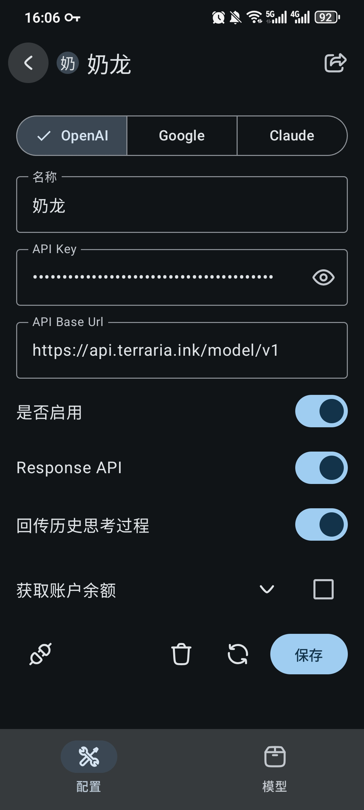
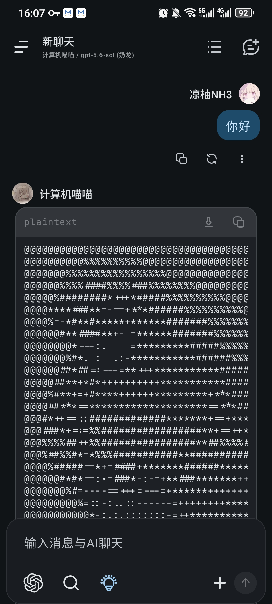
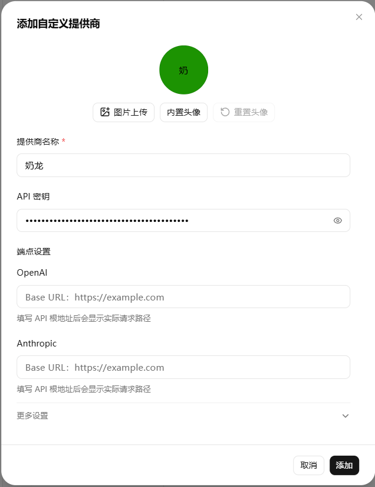

## 前言

AI 时代，相信大家对 AI 都不陌生。

那么如何使用 AI 呢？

在非理工科专业的人眼里，AI 或许是使用官方 APP / WEB 聊天的搜索引擎，但 AI 的强大远不止如此。

在数学界，核弹爆炸从今年 5 月开始，[AI 独立攻克单位距离猜想，做出准菲奖级成果](https://www.bilibili.com/video/BV11gGt6pEBg/?share_source=copy_web&vd_source=6166398577cee473a9a08ef285e4dcee)。

而到了 8 月，核弹爆炸就变成了光粒子打击，[人结合 AI 的菲奖级成果？6 维球面上的复结构！](https://www.bilibili.com/video/BV19b8v6NEtX/?share_source=copy_web&vd_source=6166398577cee473a9a08ef285e4dcee)

那么对于计算机界呢？

从历史来讲，AI 的思想可以追溯到上世纪 60 年代。但直到 2023 年，由于硬件的发展，才让原本从理论的 AI 走向现实。

典型的代表是 2023 年 gpt3.5 的问世，但实质上的改变是 23 年年末的 gpt4o，再到 24 年年初 deepseek，再到 24 年的 Gemini2.5Pro。自此之后，AI 的 coding 能力如脱缰的野马般飞驰，直到 26 年年初，claude code 的出现犹如一道惊雷，至此，AI 进入了 Agent 时代，Harness 思想野蛮地扩张，整个 AI 界迎来了前所未有的繁荣。

那么对于计算机相关专业的学生来讲，应该如何使用 AI？

## 官方 APP / WEB

最显而易见的方式是使用官方 APP / WEB 进行网页聊天，这是最传统的方式，但也是最简单的方式。

以访问 deepseek web 端为例，进入 [deepseek 官网](https://chat.deepseek.com/)，登陆后进入这样的界面：

[deepseek web 端界面](./assets/deepseek-web.png)

直接在输入框内输入问题，等待 AI 的回答即可。

下面列出常见的 AI 官方 APP / WEB 端。

### deepseek

- 官网地址：<https://chat.deepseek.com/>
- iOS 端地址：<https://apps.apple.com/app/deepseek/id6475713437>
- 安卓端地址（官方）：<https://download.deepseek.com/>
- 安卓端地址（Google Play）：<https://play.google.com/store/apps/details?id=com.deepseek.chat>

### glm

- 官网地址：<https://chatglm.cn/>
- iOS 端地址：<https://apps.apple.com/app/id6450625974>
- 安卓端地址（官方）：<https://chatglm.cn/download>
- 安卓端地址（Google Play）：<https://play.google.com/store/apps/details?id=com.zhipuai.chatglm>

### qwen

- 官网地址：<https://tongyi.aliyun.com/> （海外亦可访问：<https://chat.qwen.ai/> ）
- iOS 端地址：<https://apps.apple.com/app/id6450700832>
- 安卓端地址（官方）：<https://tongyi.aliyun.com/>
- 安卓端地址（Google Play）：<https://play.google.com/store/apps/details?id=com.alibaba.aliyun.tongyi>

### kimi

- 官网地址：<https://kimi.moonshot.cn/>
- iOS 端地址：<https://apps.apple.com/app/id6470001099>
- 安卓端地址（官方）：<https://kimi.moonshot.cn/download>
- 安卓端地址（Google Play）：<https://play.google.com/store/apps/details?id=com.moonshot.kimichat>

### gemini

- 官网地址：<https://gemini.google.com/>
- iOS 端地址：<https://apps.apple.com/app/google-gemini/id6477502980>
- 安卓端地址（官方）：<https://gemini.google.com/>
- 安卓端地址（Google Play）：<https://play.google.com/store/apps/details?id=com.google.android.apps.bard>

### claude

- 官网地址：<https://claude.ai/>
- iOS 端地址：<https://apps.apple.com/app/claude-by-anthropic/id6473753684>
- 安卓端地址（官方）：<https://claude.ai/>
- 安卓端地址（Google Play）：<https://play.google.com/store/apps/details?id=com.anthropic.claude>

### gpt

- 官网地址：<https://chatgpt.com/>
- iOS 端地址：<https://apps.apple.com/app/chatgpt/id6448311069>
- 安卓端地址（官方）：<https://chatgpt.com/>
- 安卓端地址（Google Play）：<https://play.google.com/store/apps/details?id=com.openai.chatgpt>

### grok

- 官网地址：<https://grok.com/> （或通过 X 平台访问：<https://x.ai/> ）
- iOS 端地址：<https://apps.apple.com/app/x/id333903271>
- 安卓端地址（官方）：<https://x.com/>
- 安卓端地址（Google Play）：<https://play.google.com/store/apps/details?id=com.twitter.android>

### 不要使用

豆包、文心一言、mimo、minimax、腾讯元宝。

#### 豆包

- 官网地址：<https://www.doubao.com/>
- iOS 端地址：<https://apps.apple.com/app/id6472691523>
- 安卓端地址（官方）：<https://www.doubao.com/download>
- 安卓端地址（Google Play）：<https://play.google.com/store/apps/details?id=com.ss.android.ugc.aweme.chat>

#### 文心一言

- 官网地址：<https://yiyan.baidu.com/>
- iOS 端地址：<https://apps.apple.com/app/id6446271960>
- 安卓端地址（官方）：<https://yiyan.baidu.com/>
- 安卓端地址（Google Play）：<https://play.google.com/store/apps/details?id=com.baidu.yiyan>

#### mimo

- 官网地址：<https://mimo.xiaomi.com/>
- iOS 端地址：<https://apps.apple.com/app/id6474623719>
- 安卓端地址（官方）：<https://mimo.xiaomi.com/>

#### minimax（海螺 AI）

- 官网地址：<https://hailuoai.com/>
- iOS 端地址：<https://apps.apple.com/app/id6478953158>
- 安卓端地址（官方）：<https://hailuoai.com/>
- 安卓端地址（Google Play）：<https://play.google.com/store/apps/details?id=com.minimax.hailuoai>

#### 腾讯元宝

- 官网地址：<https://yuanbao.tencent.com/>
- iOS 端地址：<https://apps.apple.com/app/id6479965825>
- 安卓端地址（官方）：<https://yuanbao.tencent.com/>
- 安卓端地址（Google Play）：<https://play.google.com/store/apps/details?id=com.tencent.hunyuan.app>

## 认识 API 与中转站

### 为什么要使用 API

你可能用官方 APP / WEB 问过问题，但是可能某段时间，你发现官方 APP / WEB 没以前那么聪明了。这本质是负载过大，导致官方 APP / WEB 暗改，降低回答质量。

那么我们有没有什么办法，自己控制模型输出的长度、质量呢？

你可能用官方 APP / WEB 写过代码，例如在 DeepSeek 网页端，把自己的 PTA 作业发给他，等待他回答，然后把代码复制粘贴到 PTA 上，完成作业。

但是你有没有想过，既然人的作用只是复制粘贴，那么有没有办法让 AI 自己控制浏览器，自己完成作业呢？

显然，APP / WEB 的 AI 你不能准确调整，而且大部分不具备控制浏览器的能力。

因为其环境被网页限制了。

但是 API 可以。

拿到 AI 的 API 之后，你可以自己设置参数，或者导入到一些自动化工具中，从而达到上面的目的。

官方往往提供了 API 以供调用，但是价格往往比较昂贵，所以可以使用第三方的中转站来使用 API。

### 中转站是什么

中转站，顾名思义是中转的站点，其作用是聚合了多家大模型官方接口的第三方分发平台。

它将不同厂商的 API 统一封装为兼容标准（如 OpenAI 格式）的接口，支持国内便捷支付充值，让用户无需绑定海外信用卡和搭建复杂网络环境，即可直接按量计费（按 Token 或按次）调用海内外顶级大模型。

然而，中转站的质量层次不齐，且十家中转站里至少有八家半的模型 “掺水”，因此需要谨慎选择。

至于中转站的价格为何会比官方便宜，有几个主要的原因：

- 号池模式：对于轻度用户而言，买一个 gpt plus 的账号是 20$，折合 20￥，将之用至上限较难。而号池模式就是多个用户公用一个账号来分摊成本
- 企业优惠：中转站可以通过企业的方式购买大量额度，获得优惠，从而降低成本
- 注册机：gpt、gemini 等模型有第一个月的免费 pro 模型体验，中转站可以利用注册机批量注册这些账号
- 贩卖数据：中转站可以贩卖用户的数据给其他厂商训练模型，从而获得收益
- 掺水：标注为 gpt5.5，实质上背后给你偶尔切成其他模型

需要注意，一般而言那些标注为 “福利”、“超低价” 的模型，或多或少都掺了水。

#### NewAPI

- 官网地址：<https://www.newapi.ai/>
- GitHub 仓库：<https://github.com/QuantumNous/new-api>

### 使用官方的 API

### 使用中转站

#### 中转站计费方式

- 按次计费

  按次算钱通常用来问答，即问 AI 问题然后 AI 给你解答。

  一般来讲，API 的能力会比网站的能力强，乃至强很多。

  - 哈基米中转站：<https://api.gemai.cc/sign-up?aff=BsVFUJmB>（一分钱一次 gemini3.7f）
  - 玖时 API：<https://api.jiushi.xin/register?aff=JDw1>（五分钱一次 gemini3.7f，作为备用站使用）

  以哈基米中转站为例，可以查看其模型广场来。

  对于大部分的中转站，是按照其自己的货币计费，以哈基米中转站为例，1RMB = 200 积分，2 积分可以使用 1 次 gemini3.7 flash。

- 按量计费

### 使用公益站

什么是公益站，简单来说，就是免费提供给用户使用的中转站，但是得通过 “拉人头” 的方式来获得额度，并且会有比较大的限制，例如并发限制以及某些时间段不得使用。

公益站的主要收入为贩卖数据，或者单纯是免费提供给用户使用。

### API 格式

#### 御三家格式

一般而言，现在的所有 AI 都使用以下三种格式（包括国内的 AI 厂商）。

- OpenAI API 格式

- Gemini API 格式

- Claude API 格式

#### Agent 格式

- Response 格式

- Claude Agent 格式

#### API 的获取方式

进入官方文档或者中转站文档，一般可以看到诸如这样的 <https://api.terraria.ink/model/v1> 请求链接，该请求链接可以复制备用。

依据文档指引申请密钥，一般而言，密钥只会出现一次。这里拿 [ACaiCat](https://github.com/ACaiCat) 做的奶龙 api（假 api）来举例，你会得到形如这样的串：

sk-4fG8kLmN2pQr5tUvW7xYzA3bCdEfGhIjKlMnOp

这就是你的 API 密钥。

需要注意，这个密钥不能泄露，否则可能会被他人滥用。

## 桌面客户端日常使用、问答与娱乐

现在我们已经知道了 AI API 是什么，以及可以从哪获取，那么如何使用这些 API 呢？

一般而言有两类场景，一类是日常使用，问答和娱乐，另一类是干活。

下面先讲讲如何在日常使用中使用 AI API。

### 使用 rikkahub

rikkahub 是专门针对手机端的 AI 工具，可以让你在手机上使用 AI API。

- 官网地址：<https://rikka-ai.com/>
- GitHub 仓库：<https://github.com/rikkahub/rikkahub>

你可以在 [release](https://github.com/rikkahub/rikkahub/releases) 页面下载到最新版本的 rikkahub。

下载下来之后，点击配置模型厂商，将上一节所说的奶龙 api 导入。

> 注意一下，一般而言对话的模型不需要开 response，这里只是示例用了 response。

通过默认助手，或者你配置的助手，和它进行聊天。

需要注意的是，如果模型不支持图的识别，你需要额外在 rikkahub 中配置图的识别。

### 使用 kelivo

kelivo 是跨平台的 AI 工具，可以让你在手机、电脑上使用 AI。

- 官方网站：<https://kelivo.psycheas.top/>
- GitHub 仓库：<https://github.com/chevey339/kelivo>

配置过程和 rikkahub 类似，在这里不再赘述。

### 使用 cherry studio

- 官方网站：<https://cherry-ai.com/>
- GitHub 仓库：<https://github.com/CherryHQ/cherry-studio>

> 你需要在设置，更多里添加 response 模式的 base url，一般而言，对话模型不需要开 response，直接在当前界面添加即可。

此外，cherry studio 也支持 agent 模式。

### 使用酒馆 SillyTavern

- SillyTavern（酒馆）GitHub：<https://github.com/SillyTavern/SillyTavern>

SillyTavern 的特点是可以导入角色卡，从而让 AI 扮演某个角色。

通常和 NFSW 场景相关，这里不进行展开。

## 使用 AI IDE / API 编程

随便找一个略懂开发的学长 / 学姐，他们的开发界面一定是类似这样的：

无论是使用什么 IDE，右侧的 CODEX / CLAUDE CODE 肯定是必不可少的。

为什么要配备这些工具呢？

答案很简单，可以方便编程。

通过这些工具，可以让 AI 自己调用自己，并且自己决定什么时候停止自己，直到它认为完成了某项任务为止。

关于使用 AI 进行编程，又分为两种，一种是绑定 IDE，另一种是基于 CLI 的。

### 使用官方 APP / WEB / 自接问答 API 对话编程

现阶段比较少，主要是学习的时候问答。

### 绑定官方 IDE

#### trae

- 官方网站：<https://www.trae.ai/>
- 客户端下载：<https://www.trae.ai/download>

#### qorder

- 官方网站：<https://www.qodo.ai/>
- VS Code 插件市场：<https://marketplace.visualstudio.com/items?itemName=Codium.codium>

#### copilot

- 官方主页：<https://github.com/features/copilot>
- 官方文档：<https://docs.github.com/copilot>
- VS Code 插件市场：<https://marketplace.visualstudio.com/items?itemName=GitHub.copilot>

#### cursor

- 官方网站：<https://www.cursor.com/>
- 客户端下载：<https://www.cursor.com/download>
- 官方文档：<https://docs.cursor.com/>

### 基于 cli 的官方 agent

#### ds + dsh

- DeepSeek 开放平台：<https://platform.deepseek.com/>
- 接口文档地址：<https://api-docs.deepseek.com/>
- DeepSeek Harness：<https://github.com/deepseek-ai/deepseek-harness>

需要注意的是，dsh 的效果可能还不如用 ds 接入其他 agent 好。

#### hunyuan4 + codebuddy

- 腾讯混元开放平台：<https://console.cloud.tencent.com/hunyuan>
- 腾讯 CodeBuddy 官网：<https://codebuddy.tencent.com/>
- CodeBuddy 插件地址：<https://marketplace.visualstudio.com/items?itemName=Tencent.codebuddy>

#### kimi + 专武

- Moonshot 开放平台：<https://platform.moonshot.cn/>
- 接口文档地址：<https://platform.moonshot.cn/docs>
- Kimi 官网入口：<https://kimi.moonshot.cn/>

#### codex

- OpenAI 开发者平台：<https://platform.openai.com/>
- OpenAI 接口文档：<https://platform.openai.com/docs>

#### antigravity

- Google AI Studio：<https://aistudio.google.com/>
- Gemini Code Assist 官网：<https://cloud.google.com/products/gemini/code-assist>

#### claude-code

- Claude Code 官方文档：<https://docs.anthropic.com/en/docs/agents-and-tools/claude-code/overview>
- npm 仓库地址：<https://www.npmjs.com/package/@anthropic-ai/claude-code>
- Anthropic 控制台：<https://console.anthropic.com/>

#### grok + cursor

- xAI 开放平台：<https://console.x.ai/>
- Cursor 官方网站：<https://www.cursor.com/>
- Cursor 下载地址：<https://www.cursor.com/download>

### 基于第三方 api 使用 agent

然而，正如前面所说的，官方的价格是昂贵的，所以可以使用第三方的中转站来使用 API。

但是格式会出现问题

可以使用以下工具来解决这个问题。

#### 使用 cc switch

如果需要干活。

- 官网地址：
- GitHub 仓库：

#### 使用 opencode

- 官网地址：<https://opencode.ai/>
- GitHub 仓库：<https://github.com/anomalyco/opencode>

## 主体与客体

## 总结

如果你是为了打比赛，干工作 / 科研中的脏活，那么我全权支持你大量的使用 AI，因为这些对你自己的提升有限。

然而，对于学习以及提升自我而言，古法编程是必要的。

无论如何，AI 只是工具。
