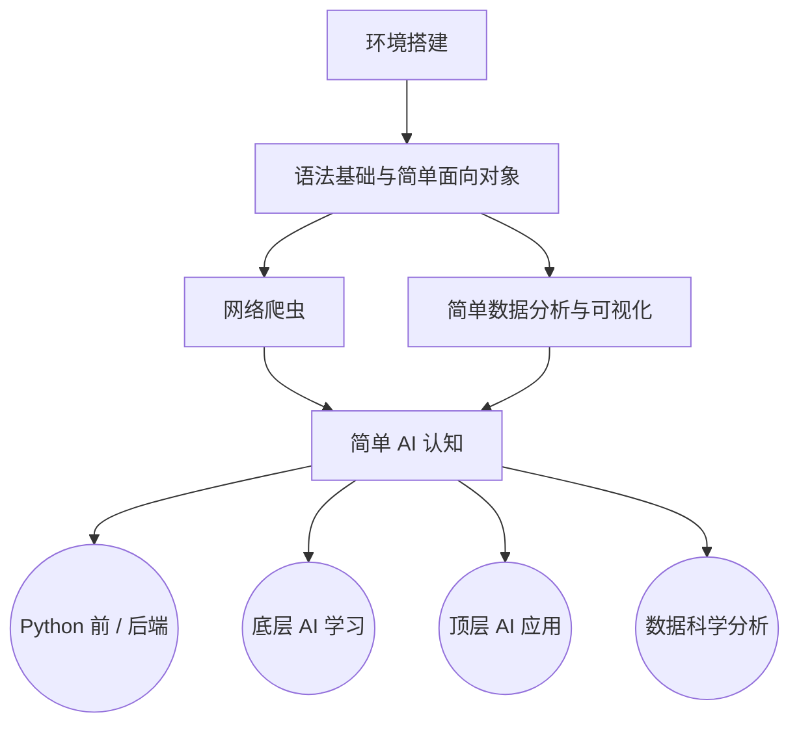

## 序

上帝说要有光，从此世间便有了光；

上帝说要有智慧，冰冷的硅晶便开始呼吸。

当涌现的灵魂在荒原上寻找发声的器官 ——

AI 以 Python 的躯体降临，宣告一个新纪元的破晓。

## 前言

本来这篇文章想讲讲考核是如何从 2025 版变成 2026 版的，但 AI 发展地太快了，许多刚写下的总结转眼便已成为过去式。

2025 年下半年到 2026 年上半年，正是我接手西二 AI 组的时间节点，而这恰好也是 AI 技术爆发最剧烈的一年。

我基于 2024 版考核，先后操刀了后续两版改革：2025 版改于去年 9 月至今年 1 月，2026 版则敲定于今年 2 月至 9 月。

正因如此，去年参加考核的同学大概都深有体会 —— 我总是在频繁地调整考核内容。这一方面受限于我自己当时认知与能力的不足，仍在摸石过河；另一方面，则是整个 AI 行业的技术风向与工业范式在短时间内发生了剧烈的颠覆，逼得我不得不推倒重来。

如果你对 2025 版考核的迭代思考仍感兴趣，你可以访问 [此处](https://blog.attilio.cc/posts/post-3/) 来获得这篇过时且混乱的博客，密码为：2004122120070130。

## AI 学习路线

首先先贴出西二在线 AI 学习路线：[https://github.com/west2-online/learn-AI](https://github.com/west2-online/learn-AI)。

回顾历代考核，它走过了一段曲折的探索期。

最早的 2023 版考核路线非常原始：学完基础的 Python 语法（不含面向对象）和爬虫后，便直奔当时的 AI 应用。而彼时的应用远不像如今调一行 API 那样方便，更多是围绕一些微型模型展开，比如写一个猫狗鼠的三分类器，或是跑跑简陋的小说续写 Demo。

到了 2024 版，当年的组长进行了一次大刀阔斧的改革：把原本只考察简单 I/O 的语法升级为面向对象宝可梦，更直接砍掉了浅层的玩具级应用，引入斯坦福经典的 CS231n 公开课作为底层支柱。24 版的整体路线由此确立为：

```mermaid
graph TD
    % 2024 版 AI 学习路线总览
    A[Python 语法基础与面向对象] --> B[爬虫与简单数据分析] --> C[AI 底层学习]
```

我接手 2025 年的组长后，受限于自身认知，早期只在 24 版的骨架上修修补补：简化了部分面向对象的难度，补充了 NumPy 基础与数模内容，异想天开地写了十几份零散的指引文档 —— 试图覆盖从传统状态机聊天机器人、YOLO 小应用到前沿论文阅读的方方面面。

但事实证明，这种修补既割裂又低效。

紧接着，2025 年末迎来大变局：Agent 浪潮迅速崛起，原先修补的那些玩具级应用在一夜之间变得毫无意义。

阵痛之下，才有了如今彻底推倒重构的 2026 版考核。我们不再强求所有人去硬啃同一座独木桥，而是在夯实基础与认知的前提下，明确拆分出各自的分支路线：



### 劝退

首先需要注意的是，如果你想开发那些你认为很高大上的东西，例如 AI 应用，本科的学历是不够的。

做这些需要你至少有 9 硕的学历。

对于 AI 的应用而言，目前尚处于基建过程中。AI 的服务化和产品化仍有较大提升空间。

所以对于 211 本科生而言，如果你更倾向于应用方向，应该去学习更多后端知识，例如 Go。

目前 AI 应用本质上仍是后端的一个分支，纯 AI 应用方向的本科生目前在就业市场上认可度相对较低。如果你的学历不够中上 985 研究生及其同层次水准，那么如果你想只做 AI 应用，也大多由后端直接转型而来，且拿的工资仍然是后端的工资。

一条比较合理对于本科生工作的路线是：主攻后端及运维，了解顶层 AI，稍微了解前端，这样可以保证你在毕业的时候可以有一个相当可观的薪资。

所以，如果你考虑好了本科找工作，建议你同时学习后端以及运维的知识，或者读研后再考虑应用方向。

这里所指的后端方向不是 Python 后端。Python 后端和前端一般只会在 Agent 的测试阶段用到，真正的 AI 应用上线仍需要 Go、Java、C++ 等后端语言。

如果你志向于科研，那么福大的资源只够你做 CV 相关，LLM 研究只有很富的组（福大没有）以及企业才做的起。

这里尖锐地指出，西二在线的负责老师并没有卡，所以你志在科研，可以学完科研入门那套东西之后，转向其他老师的组去面试。

当然，西二在线的负责老师可以作为保底。

### AI 的发展历史

现在的 AI 实在过于庞大，如果你不清楚其历史，那么你很难选对正确的切入口，学起来也云里雾里的。

这里不长篇大论地从 1960s 开始讲，而是从我们熟知的年份 —— 2023 年作为结点切分。

如果你不想看，那么看完下一小节 AI 链条后，便可以跳过本章。

#### AI 链条

对于 AI 的架构，打一个通俗易懂的链条：

数学 -> Numpy 手算反向传播 -> Pytorch 自动推导反向传播 -> Transformer 库（Hugging Face 集成 Pytorch / TensorFlow，屏蔽底层细节，抽象出 Pipeline 的概念） -> Langchain / Dify 模块化集成（轻松调用工具） -> LLM API 屏蔽所有底层细节 -> AI 应用（调用 API 完成任务、聊天机器人、Agent 调用 API）-> Harness

如果你想学底层，进实验室和老师干活，那么从数学开始学到 Pytorch 即可，接下来是去读各种各样的论文，复现论文，修改架构，得到你自己的 transformer。

如果你想学应用，并且决定要读研毕业后做这方面工作，那么学习路线将会是从 Transformer 库开始向上，直到 Harness。当然在此之前，你需要并且你必要有至少 **机器学习基础（深度学习的前身）** ，**后端基础（表现为工程直觉）** 以及 **运维基础（表现为产品直觉）**。

#### 远古时期

2023 年之前，AI 还只是在视觉上做文章。此时大众对 AI 的印象还停留在柯洁 vs 阿尔法狗，AI 的概念还只停留在影视作品里。

2023 年之前，AI 还只是在视觉上做文章。此时大众对 AI 的印象还停留在柯洁 vs 阿尔法狗，AI 的概念还只停留在影视作品里。

而对 AI 的科研和应用而言，当时还停留在各种小模型，ResNet、YOLO 称霸 CV，BERT 统治 NLP 的微调时代。

Hugging Face 更多是作为 NLP 开源模型的集散地，大家日常打比赛、做实验，基本遵循下面的套路：

下载预训练权重 -> 冻结前几层 -> 拼全连接层微调

#### 大语言模型时代

2023 年，chatgpt4 问世，可以说标志着 AI 从视觉领域转向语言领域。

此时 AI 可以处理一定的自然语言，一定的编程任务，但能力并不强。

国产此时的代表是文心一言，彼时还是国内模型的顶流，擅长处理中文文字。

随后的一年里，AI 仿佛沉寂一般，并没有什么特别大的进展。模型参数量越堆越大，但能力边际递减，幻觉、长文本丢失问题频出，行业陷入了对算力枯竭与泡沫破灭的质疑。

直到 2024 年末 chatgpt4o 出现，以及 2025 年年初 deepseek 携开源之势横空出世，以激进的架构创新和推理性能震动整个技术界。

在这之后，2025 年 4 月的 Gemini2.5pro 凭借超长上下文与近乎无损的多模态推理能力再度拉高了工业基线，模型竞争彻底演变为全方位的推理智能军备竞赛。

#### 基于 IDE 的编程

2025 年 7 月，cursor 爆火，将 WEB 聊天式的 AI 编程推向了 AI 辅助代码补全和 AI 自主工程重构。

随后 copilot 迅速跟进，全方位集成 Workspace Agent，开发者开始习惯直接用自然语言描述需求并由 IDE 批量修改跨文件代码。

直到 2026 年的 3 月，openclaw 的爆火，标志着自主化、沙盒运行与环境自愈的代码智能体彻底下沉为日常基建。

#### Agent 时代

Claude Code，Codex 各种纯自动化工具接管了终端与部署链条。人类程序员正不可逆转地从敲代码的搬砖工转型为审核逻辑的架构师与给 Agent 擦屁股的运维员。

### 环境搭建与基本计算机思维

从这里开始，才是真正的进入人工智能的学习路线。

你可以结合 2026 版的 AI 考核路线来向下阅读。

#### 配环境

编程环境将跟随你的整个程序员生涯，因此你需要慎重对待。

配环境可以参考 2026 考核中给出来的路径，或者以下几篇博客：

[python：从入门到入门 - RE：从保姆开始的python及其相关环境配置指南](https://blog.weijx.vip/p/python%E4%BB%8E%E5%85%A5%E9%97%A8%E5%88%B0%E5%85%A5%E9%97%A8/)

[UV 如何使用](https://blog.weijx.vip/p/uv%E5%A6%82%E4%BD%95%E4%BD%BF%E7%94%A8/)

[萌新向：从零开始，用 VS Code 写出你的第一行Python代码](https://schariac125.online/posts/%E8%90%8C%E6%96%B0%E5%90%91%E4%BB%8E%E9%9B%B6%E5%BC%80%E5%A7%8B%E7%94%A8-vs-code-%E5%86%99%E5%87%BA%E4%BD%A0%E7%9A%84%E7%AC%AC%E4%B8%80%E8%A1%8Cpython%E4%BB%A3%E7%A0%81/)

#### 写文档

写文档的能力决定了你能走的多稳。在 Agent 已经能秒级生成代码的当下，代码本身的编写成本几乎归零，真正的资产转变为清晰的需求定义、结构化的架构设计与严谨的接口规范。

因此，我比较强调 markdownlint 的规范以及 Apple 规范。如果一个工科生连 Markdown 都排不整齐，连自己的设计意图都讲不明白，那么面对 AI 生成的代码山，你将毫无驾驭能力。

#### 基本计算机思维

开源、共享、精读文档，以及慎重。

请记住：别人的时间也是时间。

### Python 基础

对于 Python 基础

事实上，Python 是一门 “胶水语言”，它的底层库都是用 C 或者其他语言写的。

正如序中提到的那样，“AI 以 Python 的躯体降临”，只是单纯因为。

是 AI 选择了 Python，而不是 Python 选择了 AI。

#### 基础语法与 OI

#### 简单面向对象

即使我们是学 AI 的，我们也得稍微会一点面向对象。

2023 年语法轮

2024 年的宝可梦

但实实在在的，宝可梦想研究起来确实有的研究，所以在和今年的组长 []() 讨论过后，决定把作业 2-4 改为 3 选 2。

### 爬虫

AI 的训练需要数据，那么数据从何处来？

### 简单数据分析

即使 AI 已经被

### 基本 AI 认识

这是本人在 2026 考核新增的，目的是为了科普。

毕竟现在已经不像去年那样，

### 人工智能的底层

人工智能底层是数学，更准确来说，学习人工智能底层并不需要太多计算机的思维，更多的是微积分，线性代数和一点点 Python 语法。

这部分内容

所以 24 级 AI 组组长

引入了

并沿用至今。

带着手撕原码

所以最后权衡利弊，采用公开课 + 汇报的方式。

#### 机器学习

在要完成 CS231n 之前，我还设置了。

#### 深度学习

CS231n 的后续是

#### NLP 与 CV

NLP。最早的 NLP 可以追溯到翻译。

#### 更进一步 —— 复现论文

学完了以上东西，你就有资格去读 AI 科研领域的所有论文了。

那么接下来你要干什么呢？你要做的事情

这也正是 Research 2 要你做的事情。

#### 再向前 —— 找导师

接下来你要做的事情就是找老师做科研了。

### Python 后端与数据分析

#### Python 后端

在疫情结束后的微服务与敏捷开发大潮中，轻量级框架被推上了前台，

例如 fastapi，flask 等。

我非常讨厌 fastapi，一个很重要的原因是很多 AI 再

#### 数据分析

数据挖掘，

被大模型冲烂了

不过还是可以去打打 kaggle 比赛，或者打打数学建模。

仅作为丰富一下自己的阅历。

### AI 应用方向

对于 AI 应用，后续必然还会迭代。但是先这样，这已经是本人能抽出时间的极限了。

更多的等今年组长再看，或者等一百天后我再看看。

毕竟今天是 “百日誓师”，

我始终认为，学 AI 应用之前，你必须先学完 AI 底层、后端、运维。

其实很多东西并非谁是谁的前置，最根本的东西是工程直觉。

AI 应用

除非你的计算机直觉已经达到了一个很强的水平。

并且，AI 应用方向很杂，容易你学完了都不知道自己在学什么。

所以我硬性加入了一个后端项目，写完那个才能写 AI 应用。

#### 简单机器学习

正如前文所述，

#### Yolo 的基本应用

#### HuggingFace

#### API 的基本使用

#### 声纹识别

#### 传统聊天机器人

#### Agent 使用

然而，本轮的设计也只是做玩具。

真正理想中的 Agent 或许只有在企业内才见得到。

#### 更多的 AI 应用

例如 AI 网关，负责多模型路由、负载均衡、鉴权、缓存及故障熔断；

以及 AI 工作流 + AI 生图的工业级落地（如 ComfyUI 节点编排与自动化海报流水线）。

由于本人的经历与精力限制，并没有涉猎。

## 结语

正如我在 [如何使用 AI](https://blog.attilio.cc/posts/post-7/) 中提到的，如果你是为了打比赛、应付工作或科研中的杂活脏活，我全权支持你最大化地拥抱 AI。把精力耗费在机械劳动上，对自身认知的提升极其有限。

然而，对于学习以及提升自我而言，古法编程这个阶段是必要的。

这里的 “古法” 并非指手敲每一行代码，而是设计架构、思路、核心业务逻辑，必须出自于你自己的思想，或者至少由你主导并与 AI 深入推敲而得出，而非依赖不可控的 “AI 抽卡” 碰运气。

可是现在并没有这个环境给我们 “古法”，AI 的发展速度太快了。

[OpenAI 官宣攻克千禧年七大难题的 NS 方程问题](https://www.bilibili.com/video/BV1SdYn6cEoq/?share_source=copy_web&vd_source=6166398577cee473a9a08ef285e4dcee)

AI 刚刚在 5 月末凭借证伪 “单位距离猜想” 击败了 “金丹期”，转眼到 9 月初便已击败 “大乘”。

短短三个月，AI 攻城略地的号角已然吹进了人类最严苛的阵地 —— 形式科学。

倘若连纯粹抽象、严密证明的数学高地都难以坚守，那么人类编程还剩下为数不多的优势 —— “架构设计”，在更高级的智能面前究竟还能从容多久？

或许，历史真的在以意想不到的速度，推着我们走向某种近乎社会主义的理想图景 ——

当生存的压力被彻底剥离，学习与工作是否终将蜕变为一种纯粹取悦自我的消遣？

对此，站在当下的十字路口，我们尚不得而知。
