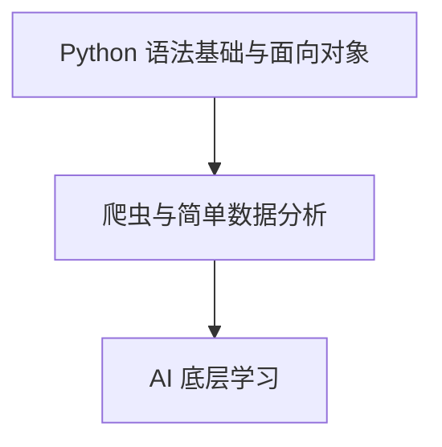
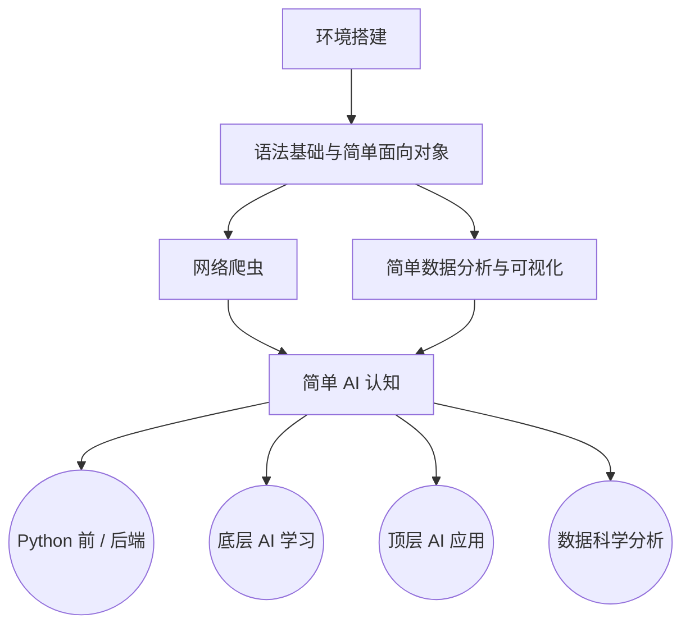

## 序：硅基破晓

上帝说要有光，从此世间便有了光；

上帝说要有智慧，冰冷的硅晶便开始呼吸。

当涌现的灵魂在荒原上寻找发声的器官 ——

AI 以 Python 的躯体降临，宣告一个新纪元的破晓。

## 前言：剧变时代

本来这篇文章想讲讲考核是如何从 2025 版变成 2026 版的，但 AI 发展地太快了，许多刚写下的总结转眼便已成为过去式。

2025 年下半年到 2026 年上半年，正是我接手西二 AI 组的时间节点，而这恰好也是 AI 技术爆发最剧烈的一年。

我基于 2024 版考核，先后操刀了后续两版改革：2025 版改于去年 9 月至今年 1 月，2026 版则敲定于今年 2 月至 9 月，未来也必定会继续操刀 2027 版的考核。

正因如此，去年参加考核的同学大概都深有体会 —— 我总是在频繁地调整考核内容。这一方面受限于我自己当时认知与能力的不足，仍在摸石过河；另一方面，则是整个 AI 行业的技术风向与工业范式在短时间内发生了剧烈的颠覆，逼得我不得不推倒重来。

如果你对 2025 版考核的迭代思考仍感兴趣，你可以访问 [此处](https://blog.attilio.cc/posts/post-3/) 来获得这篇过时且混乱的博客，密码为：2004122120070130。

## AI 学习路线的变化：曲折求索

首先先贴出西二在线 AI 学习路线：[https://github.com/west2-online/learn-AI](https://github.com/west2-online/learn-AI)。

回顾历代考核，它走过了一段曲折的探索期。

最早的 2023 版考核路线非常原始：学完基础的 Python 语法（不含面向对象）和爬虫后，便直奔当时的 AI 应用。而彼时的应用远不像如今调一行 API 那样方便，更多是围绕一些微型模型展开，比如写一个猫狗鼠的三分类器，或是跑跑小说续写 Demo。

到了 2024 版，当年的组长进行了一次大刀阔斧的改革：把原本只考察简单 I/O 的语法升级为面向对象宝可梦，更直接砍掉了浅层的玩具级应用，引入斯坦福经典的 CS231n 公开课作为底层支柱。24 版的整体路线由此确立为：

我接手 2025 年的组长后，受限于自身认知，早期只在 24 版的骨架上修修补补：简化了部分面向对象的难度，补充了 NumPy 基础与数模内容，异想天开地写了十几份零散的指引文档 —— 试图覆盖从传统状态机聊天机器人、YOLO 小应用到前沿论文阅读的方方面面。

但事实证明，这种修补既割裂又低效。

紧接着，2025 年末迎来大变局：Agent 浪潮迅速崛起，原先修补的那些玩具级应用在一夜之间变得毫无意义。

阵痛之下，才有了如今彻底推倒重构的 2026 版考核。我们不再强求所有人去硬啃同一座独木桥，而是在夯实基础与认知的前提下，明确拆分出各自的分支路线：

当然，上述路线其实并不细致，例如 AI 应用那块知识过于杂碎，AI 底层那块又过于浅显。

未来会不断进步。

## 劝退：冷水与现实

> 在投入热情之前，先看清你究竟在整个技术生态的哪个位置。

### AI 链条

如果把整个现代 AI 的技术栈铺开，它实际上是一条底层细节不断被屏蔽、抽象程度不断提高的链条：

> 数学 $\to$ Numpy 手算反向传播 $\to$ Infra 专用算子 $\to$ PyTorch 自动推导反向传播 $\to$ Transformer 库（Hugging Face 集成，屏蔽计算细节，抽象出 Pipeline） $\to$ LangChain / Dify 模块化集成（轻松编排工作流与调用工具） $\to$ LLM API（彻底屏蔽底层，黑盒化模型输出） $\to$ AI 应用（聊天机器人、多智能体 Agent 协作） $\to$ Harness（评测基准与业务治理）

数学 -> Infra -> Pytorch -> Transformer -> Langchain / Dify -> LLM API -> Agent -> Harness

在这条链条中，越往右走，模型算法的比重就越稀释，工程化与业务胶水的属性就越浓厚。

与架构链条并行的，是模型本身的工业训练生命周期：

> 预训练（得到基座模型，如 Llama/Qwen） $\to$ 后训练（对齐、SFT、RLHF） $\to$ 任务级微调（LoRA 等针对特定业务适配）

预训练 -> 后训练 -> 微调。

在这条链条中，越右走，对模型能力本身的影响就越弱。

### 名词解释

- 数学：现代人工智能的理论底座，通过线性代数、微积分与概率统计等工具，为模型算法提供严密的逻辑推导与计算规则。
- Numpy 手算反向传播：脱离高级深度学习框架，纯靠编写基础矩阵运算代码来推导模型误差与梯度更新的最原始计算过程。
- Infra 专用算子：直接面向 GPU 等底层硬件深度定制的高性能计算函数，旨在压榨硬件性能以实现极致的运算吞吐与内存利用率。
- PyTorch 自动推导反向传播：主流深度学习框架内置的自动求导机制，开发者无需手动计算导数即可自动完成梯度回传与参数更新。
- Transformer 库（Hugging Face）：工业界广泛采用的开源模型工具库，它封装了底层的模型网络细节，让用户通过简短的代码即可加载与调用前沿模型。
- LangChain / Dify：连接大模型与外部系统的工作流编排工具，通过模块化组件方便开发者将模型与数据库、外部工具组合成复杂业务流程。
- LLM API：云端大语言模型提供的调用接口，对调用者完全隐藏模型的具体参数与内部实现，仅通过网络收发文本即可获取能力。
- AI 应用与 Agent（智能体）：大模型落地的具体软件形态；其中 Agent 能自主拆解复杂目标、感知环境并主动调用外部工具完成任务。
- Harness：标准化的大模型评估测试框架，用于全面检验模型在逻辑、常识、安全等多项客观基准上的综合性能。
- 预训练：使用海量无标注文本驱动模型进行通识性自主学习，消耗庞大算力以构建出具备通用语言认知能力的“基座模型”。
- 后训练：在基座模型之上通过指令微调（SFT）和人类反馈对齐（如 RLHF），使模型学会服从人类意图并符合安全规范。
- 任务级微调（如 LoRA）：在冻结大部分原始参数的前提下，仅使用少量业务数据与低算力成本对模型进行针对性修正，使其适配具体的垂直应用场景。

### 学习 AI 可以做什么工作

AI 浪潮确实创造了大量岗位，但这些岗位大多依赖学历（中上 9 硕起步或同等能力证明，例如 ACM 金牌 / 银牌）。

主要衍生出的岗位谱系如下：

- Agent 开发
- AI 应用算法
- 后训练开发
- Infra 开发
- 预训练开发，进入基模团队
- AI 算法
- 硬件

对于难易程度而言，则是 **从上至下越来越难** 的趋势。

- Agent 开发：听起来最高大上，但本质是后端开发。对于本科生而言，即便进去接触到了 Agent 开发，也大多是由后端转型而来，拿的也是后端的工资。不过如果你的学历上去了，那么工资就会多一个较为可观的水准；但并且因为其本质仍是业务后端，所以上限并不高。到这个层次为止，我们还没有接触到修改 AI 本身的东西，仅仅是 AI 的工业化调用。

- AI 应用算法：门槛稍微比 Agent 开发高一些，起步为中上 9 硕。可以理解为开发一个垂直领域的专用模型，或者基于开源基座模型进行微调与二次定向适配。

这两个岗位其实目标类似，本质上都是要把业务指标提上去。只不过 Agent 开发利用的是后端和运维的工程知识，不涉及模型结构本身；而 AI 应用算法则是直接对模型本身进行微调，或者训练一个小模型去完成特定的定制任务。

如果可以的话，尽量还是多碰模型本身相关的事情，这样有机会去走到更下面的层次，例如后训练开发。

- 后训练开发：起步为中上 9 硕，主要聚焦在模型基座出炉后的能力激发与意图对齐，手段包括监督微调（SFT）以及基于强化学习（RLHF / DPO 等）的偏好对齐，让模型不仅“能说话”，更能“听懂人话并按规范做任务”。

- Infra 开发：起步为中上 9 硕，可以简单理解为专注于大模型底层算子优化、大规模分布式训练/推理系统的软硬件协同工程，核心任务是在集群中把 GPU 性能压榨到极致，解决通信瓶颈、显存溢出与高并发吞吐问题。

- 预训练开发与基模团队：门槛基本是 PhD 起步，并且你的手里通常还需要有至少 5 篇顶会 A 的硬核科研成果背书。可以简单理解为预训练决定了模型的上限，而后训练则是决定了模型的下限。

当然，我在这里说了这么多，肯定无法抵御你对 AI 学习的热情。

对于 Infra，这不是 211 本科生在资源受限的情况下可以轻易接触的东西，所以我们略去不学。对于我们普通 211 本科生而言，可行的路径应根据毕业去向进行较为清晰的分流。

如果你志向于科研（打底层、进实验室）

- 学习路径：如果你想学底层，进实验室和老师干活，那么从数学开始学到 PyTorch 即可。接下来是去读各种各样的顶级论文，复现论文代码，修改网络架构，最终跑出你自己的 Transformer 变体。
- 现实局限与选择：福大的资源只够你做 CV（计算机视觉）相关；LLM（大语言模型）研究只有极其富裕的组（福大没有）以及大企业才烧得起算力。
- 实验室策略：这里尖锐地指出，西二在线的负责老师并没有卡。可以学完科研入门那套基础东西之后，转向其他老师有卡、有课题的组去面试。当然，西二在线负责老师的平台可以作为极好的保底。
- 更进一步：保研后前往富组做垂直领域，例如后训练等。

如果你想学应用（决定读研深造）

- 学习路径：如果你决定读研毕业后做应用方向，那么学习路线将会是从 Transformer 库开始向上推进，直到掌握 Harness 评测与治理体系。
- 前置学习：在此之前，你需要并且必要拥有至少：
  - 机器学习基础（深度学习的前身，构建基础直觉）；
  - 后端基础（表现为对系统链路的工程直觉）；
  - 运维基础（表现为高可用与部署的产品直觉）。
- 进阶目标：如果你未来想冲 AI 应用算法岗，那么上述从底层 PyTorch 到上层 Harness 的所有内容，你都必须要有所涉猎。

如果你考虑本科毕业直接就业

- 路线：一条比较合理的路线是：主攻后端及运维，了解 Agent 开发，稍微了解前端。这样可以保证你在毕业的时候能够拿到一个相当可观的薪资。
- 语言避坑指南：这里所指的后端方向不是 Python 后端。Python 后端和前端一般只会在 Agent 的前期 Demo 验证或测试阶段用到；真正的工业级 AI 应用大规模上线投产，核心支撑架构仍需要 Go、Java、C++ 等强类型、高并发的工业级后端语言。
- 结论：如果你考虑好了本科找工作，建议你同时死磕后端以及运维的硬核知识；若对模型算法应用念念不忘，建议读研之后再做
考虑。

## AI 的发展历史：我们是如何走到 Agent 时代的？

> 不理清历史的断代，就无法在如今繁杂的概念中找到落脚点。

现在的 AI 实在过于庞大，如果你不清楚其历史，那么你很难选对正确的切入口，学起来也云里雾里的。

这里不长篇大论地从 1960s 开始讲，而是从我们熟知的年份 —— 2023 年作为结点切分。

### 远古时期

2023 年之前，AI 还只是在视觉上做文章。此时大众对 AI 的印象还停留在柯洁 vs 阿尔法狗，AI 的概念还只停留在影视作品里。

2023 年之前，AI 还只是在视觉上做文章。此时大众对 AI 的印象还停留在柯洁 vs 阿尔法狗，AI 的概念还只停留在影视作品里。

而对 AI 的科研和应用而言，当时还停留在各种小模型，ResNet、YOLO 称霸 CV，BERT 统治 NLP 的微调时代。

Hugging Face 更多是作为 NLP 开源模型的集散地，大家日常打比赛、做实验，基本遵循下面的套路：

下载预训练权重 -> 冻结前几层 -> 拼全连接层微调

### 大语言模型时代

2023 年，chatgpt4 问世，可以说标志着 AI 从视觉领域转向语言领域。

此时 AI 可以处理一定的自然语言，一定的编程任务，但能力并不强。

国产此时的代表是文心一言，彼时还是国内模型的顶流，擅长处理中文文字。

随后的一年里，AI 仿佛沉寂一般，并没有什么特别大的进展。模型参数量越堆越大，但能力边际递减，幻觉、长文本丢失问题频出，行业陷入了对算力枯竭与泡沫破灭的质疑。

直到 2024 年末 chatgpt4o 出现，以及 2025 年年初 deepseek 携开源之势横空出世，以激进的架构创新和推理性能震动整个技术界。

在这之后，2025 年 4 月的 Gemini2.5pro 凭借超长上下文与近乎无损的多模态推理能力再度拉高了工业基线，模型竞争彻底演变为全方位的推理智能军备竞赛。

### 基于 IDE 的编程

2025 年 7 月，cursor 爆火，将 WEB 聊天式的 AI 编程推向了 AI 辅助代码补全和 AI 自主工程重构。

随后 copilot 迅速跟进，全方位集成 Workspace Agent，开发者开始习惯直接用自然语言描述需求并由 IDE 批量修改跨文件代码。

直到 2026 年的 3 月，openclaw 的爆火，标志着自主化、沙盒运行与环境自愈的代码智能体彻底下沉为日常基建。

### Agent 时代

Claude Code，Codex 各种纯自动化工具接管了终端与部署链条。人类程序员正不可逆转地从敲代码的搬砖工转型为审核逻辑的架构师与给 Agent 擦屁股的运维员。

## 2026 学习路线

> 待施工。

## 结语：在不确定的浪潮中锚定自己的坐标

正如我在 [如何使用 AI](https://blog.attilio.cc/posts/post-7/) 中提到的，如果你是为了打比赛、应付工作或科研中的杂活脏活，我全权支持你最大化地拥抱 AI。把精力耗费在机械劳动上，对自身认知的提升极其有限。

然而，对于学习以及提升自我而言，古法编程这个阶段是必要的。

这里的 “古法” 并非指手敲每一行代码，而是设计架构、思路、核心业务逻辑，必须出自于你自己的思想，或者至少由你主导并与 AI 深入推敲而得出，而非依赖不可控的 “AI 抽卡” 碰运气。

可是现在并没有这个环境给我们 “古法”，AI 的发展速度太快了。

[OpenAI 官宣攻克千禧年七大难题的 NS 方程问题](https://www.bilibili.com/video/BV1SdYn6cEoq/?share_source=copy_web&vd_source=6166398577cee473a9a08ef285e4dcee)

AI 刚刚在 5 月末凭借证伪 “单位距离猜想” 击败了 “金丹期”，转眼到 9 月初便已击败 “大乘”。

短短三个月，AI 攻城略地的号角已然吹进了人类最严苛的阵地 —— 形式科学。

倘若连纯粹抽象、严密证明的数学高地都难以坚守，那么人类编程还剩下为数不多的优势 —— “架构设计”，在更高级的智能面前究竟还能从容多久？

或许，历史真的在以意想不到的速度，推着我们走向某种近乎社会主义的理想图景 ——

当生存的压力被彻底剥离，学习与工作是否终将蜕变为一种纯粹取悦自我的消遣？

对此，站在当下的十字路口，我们尚不得而知。
